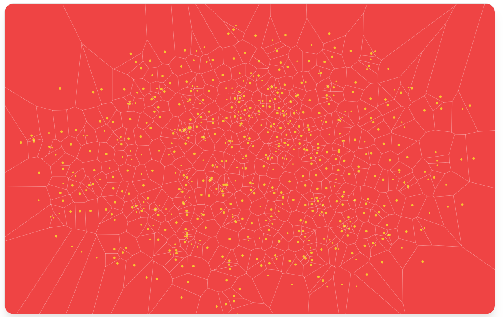

## Semantic Data Fabric
A Semantic Data Fabric creates a structured, interconnected representation of your data using [contextually aware embeddings](./contextually_aware_embedding.md). This fabric not only enhances retrieval capabilities but also supports advanced graph traversal techniques for deeper insights.

*A voronoi point map to represent a 2D plot of contextually aware vectors as interconnected points in the semantic data fabric.*
 

### Key Features:
 - **Integrated Context:** Combines multiple data points and their attributes, capturing the full context of the information.
 - **Structured Representation:** Forms a network of interconnected data points, enabling advanced search and analysis techniques.
 - **Enhanced Retrieval:** Supports natural language search queries that go beyond mere keyword matching to consider the context and connections embedded in the data.

## Semantic Data Fabric and Event Management

### Overview

 R!AN leverages the power of [event-driven architecture](../guides/generated_events.md), where events are not just isolated occurrences but interconnected data points that collectively form a semantic network. By utilizing relational databases like Postgres, the system can manage connections and high-dimensional data, offering search capabilities that go beyond traditional keyword-based or index based searches.

### How Events Create the Semantic Data Fabric

Events serve as the fundamental units of data that are stored, interconnected, and queried to build a Semantic Data Fabric. The interconnectivity of events is managed through the use of unique **Event IDs** that links vector events, index events, and graph events.

### Advantages Over Keyword-Based Search

Traditional keyword-based search methods rely heavily on exact matches between search queries and indexed keywords. While effective for basic text retrieval, this approach has several limitations:

1. **Lack of Context:** Keyword searches do not account for the relationships between different data points, often missing the broader context in which terms are used.
2. **Limited Precision:** Without understanding the semantics or underlying meaning of the data, keyword searches can return irrelevant results or miss relevant ones that do not include the exact keyword.
3. **Scalability Issues:** As datasets grow, keyword-based searches can become less efficient and slower, especially when dealing with unstructured data.

In contrast, R!AN's Semantic Data Fabric enables:

- **Contextual Understanding:** By capturing relationships through graph events and semantic connections, the system can retrieve data based on meaning and context, not just keywords.
- **High Dimensionality Searches:** Vector events allow for similarity searches and machine learning models that can find patterns and insights beyond the reach of keyword searches.
- **Efficient Data Management:** By using PostgreSQL for indexing and connecting events through Event IDs, the system can efficiently manage and query vast amounts of interconnected data, providing faster and more relevant search results.

### Conclusion

By integrating Index, Graph, and Vector events using a unified Event ID schema within PostgreSQL and specialized databases, your system creates a powerful Semantic Data Fabric. This approach not only enhances data connectivity and retrieval but also enables advanced search functionalities that go beyond traditional methods, providing richer, more accurate insights from your data.