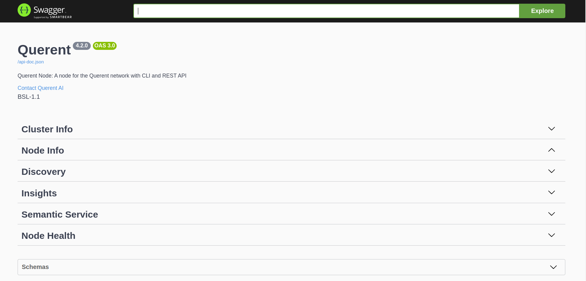
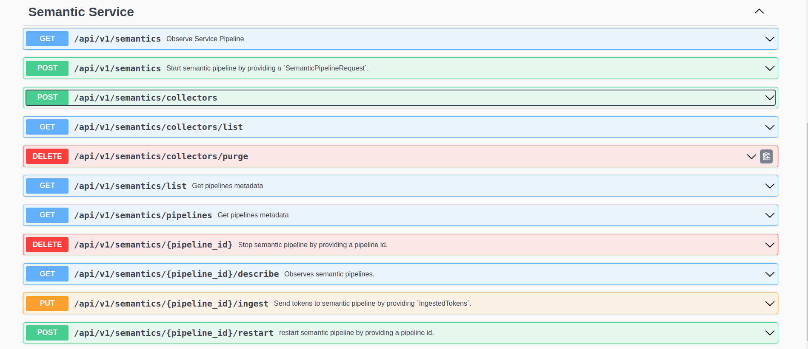
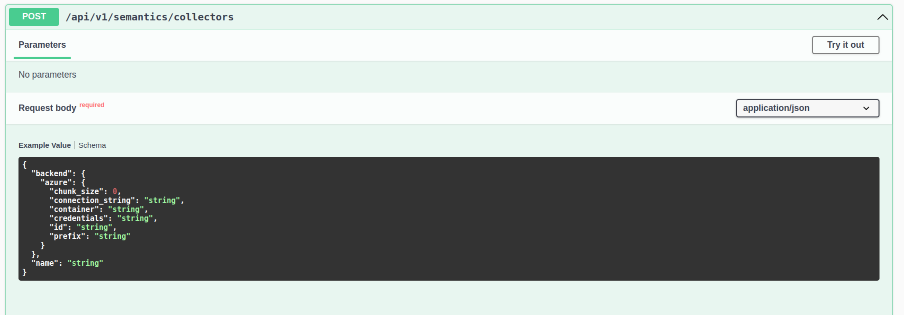
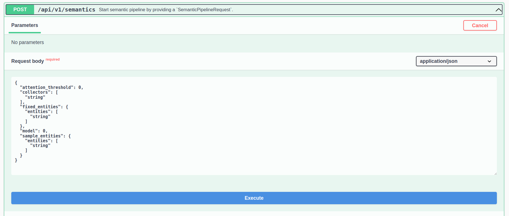

import Tabs from '@theme/Tabs';
import TabItem from '@theme/TabItem';

This guide outlines the steps on how to use R!AN to create a semantic data fabric over your private data by initializing data sources and executing semantic data fabric queries.

## Access the R!AN Dashboard

Once you have started the R!AN server, you can access the R!AN dashboard to start creating semantic data fabric with your data.

### Steps to Access the Dashboard

1. **Start the R!AN Server**

   Depending on your configuration, start the R!AN server using one of the following commands:

    **With PostgreSQL:**

    ```bash
   
    rian serve --config path/to/your/node.yaml
    ```

    **With SurrealDB:**

    ```bash
   
    rian serve
    ```


2. **Navigate to the Dashboard**

  Starting a R!AN server in serve mode will automatically open the dashboard in a browser tab.

  

<br />

## Using the R!AN Dashboard

### Overview
The R!AN dashboard provides an intuitive interface for managing your data, including sections for Cluster Info, Node Info, Discovery, Insights, Semantic Service, and Node Health.

#### Cluster Info
Cluster Information: Provides details about the cluster, including nodes, status, and configuration.

#### Node Info
Node Details: Displays information about the current node, including its ID, status, and configuration.

#### Discovery
Service Discovery: Manages the data discovery services within the cluster.

#### Insights
Insights Management: Allows you to view and manage insights generated by the system.

#### Semantic Service
Semantic Pipelines: Runs semantic pipelines assigned by the control plane.

#### Node Health
Health Monitoring: Monitors the health and performance of the node, providing detailed metrics and status reports.

### Setup Data Sources

#### Navigate to the Semantic Service Section



<br />

#### Initialize Data Source(s)

  - R!AN supports a variety of data sources. For detailed information, please refer to the [data sources documentation.](../../working-with-rian/data_sources.md).



<br />

  To initialize a local file folder source, use the following configuration:

```json
{
        "backend": {
        "files": {
           "root_path": "path/to/your/local/file/folder",
           "id": "File Collector 1"
          }
      },
      "name": "Demo Collector"
    }
```

  In this example, we are initializing a single data source. You can add additional data sources based on your specific data locations and requirements.


### Create Semantic Data Fabric

#### Start the Semantics service

  To start processing the data and create a semantic data fabric over your private data, follow these steps:

1. **Navigate to the Semantic Pipeline Request**


<br />


2. **Customize the Options**

  ```json
  {
    "attention_threshold": 0,
    "collectors": [
      "string"
    ],
    "fixed_entities": {
      "entities": [
        "string"
      ]
    },
    "model": 0,
    "sample_entities": {
      "entities": [
        "string"
      ]
    }
  }

  ```
  - attention_threshold: R!AN uses attention matrices from transformer models to construct the semantic data fabric. This threshold filters out data fabrics that fall below the specified score.  
  - collectors: A list of sources to be used for fetching data.
  - fixed_entities: A list of entities around which the semantic data fabric will be constructed.
  - sample_entities: The types of the entities specified in fixed_entities.
  - model: Choose the model to use for Named Entity Recognition (NER).
    - Pass 0 to use the English-based NER model.
    - Pass 1 to use the Geology-based NER model.
    - If no model and no entities are specified, the default is the English-based NER model.


3. Successful execution of the Semantic Pipeline Request will return a unique pipeline_id. This pipeline_id acts as a unique identifier for the semantic data fabric created during this session. This feature allows users to create different data fabrics using various semantic pipeline options, which is usef ul for :

  - Flexibility: Users can create multiple semantic data fabrics over the same data or different data sets. This flexibility allows for comparative analysis and tailored insights based on different configurations and parameters.
  - Customization: Each pipeline_id corresponds to a specific semantic pipeline configuration. Users can experiment with different settings to optimize their data discovery and insight generation processes.
  - Organized Data Management: With unique pipeline_ids, users can manage and organize their data fabrics efficiently, ensuring that each fabric can be referenced, modified, or analyzed independently.
  - Enhanced Insight Generation: By creating multiple semantic data fabrics, users can uncover a broader range of insights and patterns, improving decision-making and strategic planning.


<br />

  **Important Note**
    
  Remember to note down the pipeline_id returned after each successful execution of a semantic pipeline. This ID is crucial for performing searches and generating insights later. Each pipeline_id ensures that you can accurately reference and utilize the specific data fabric created during your session.

## Summary
  The R!AN dashboard simplifies the management of your data and services, providing a user-friendly interface to interact with and monitor your cluster. By following the steps outlined in this guide, you have created a semantic data fabric using R!AN.