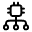
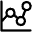

## Data Fabric
A Data Fabric  creates a structured, interconnected representation of your data using [Attention-Based Graph Embeddings](./attention_embedding.md). This fabric enhances retrieval capabilities and supports advanced graph traversal techniques for deeper insights.

*A Voronoi point map representing a 2D plot of contextually aware vectors as interconnected points in the data fabric.*
 

### Key Features:
 - **Integrated Context:** Combines multiple data points and their attributes, capturing the full context of the information.
 - **Structured Representation:** Forms a network of interconnected data points, enabling advanced search and analysis techniques.
 - **Enhanced Retrieval:** Supports natural language search queries that consider the context and connections embedded in the data, going beyond mere keyword matching.

### Creating a Data Fabric
Various methodologies exist to create a data fabric, each tailored to different types of data and analytical needs:

#### 1. **Attention Graph Network**

Attention Graph Network leverages attention matrices from transformer models. This method focuses on the relationships identified by attention weights between different entities or concepts within a data sequence.

- **Attention Mechanisms**: Attention matrices reveal the strength and relevance of connections between data points.

- **Fabric Construction**: These attention-weighted relationships are mapped into a data fabric, where nodes represent entities/concepts and edges signify the strength of their connections.

- **Use Case**: Ideal for scenarios where semantic understanding of textual data is crucial, such as natural language processing tasks, semantic search queries, or any textual data analysis.

#### 2. **Temporal Graph Network**

Temporal Graph Networks use a module-based framework to convert time-series data—whether textual or numerical—into Attention-Based Graph Embeddings. This approach, combined with unsupervised algorithms, automatically detects anomalies.

- **Contextual Embeddings of Time-Series Data**: Transforms time-series data into embeddings that capture temporal patterns and trends within the data.

- **Anomaly Detection and Forecasting**: Utilizes unsupervised algorithms as part of a comprehensive anomaly detection pipeline to identify anomalies.

- **Use Case**: This approach is particularly useful in fields like finance or IoT, where understanding temporal trends or detecting anomalies in time-series data is critical.

#### 3. **Code Fabric**

Code Fabric is designed to enhance the efficiency of code management and discovery within enterprises. Every piece of code—classes, objects, or methods—is represented as a graph, where the relationships between these components form the fabric.

- **Fabric Representation of Code**: Code is treated as a network of interconnected components (e.g., classes, methods, variables). The system identifies and maps these relationships, allowing for easy discovery and reuse of similar code snippets.

- **Efficiency in Code Reuse**: By connecting related pieces of code, this fabric helps developers quickly identify reusable components, improving development efficiency.

- **Use Case**: articularly useful in large codebases where finding and reusing existing code components can save time and resources, especially in collaborative environments.

### Conclusion

A Data Fabric represents a data transformation approach to organizing and analyzing complex datasets by creating an interconnected network of data points.
