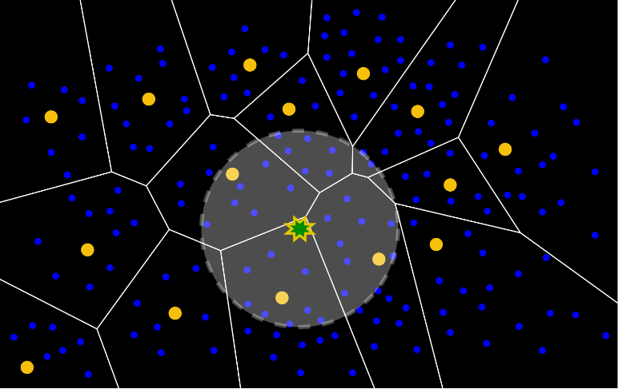

## Overview

This guide outlines the different data discovery methods available within R!AN. Understanding these methods is integral for efficiently discovering data and generating meaningful insights.

### Retriever-Based Search

Retriever-based search is designed to find relevant documents and contexts using natural language queries. It utilizes [Attention-Based Graph Embeddings](../features/attention_embedding.md) to perform similarity searches over the data fabric, focusing on retrieving data points that are semantically similar to the query. This approach is efficient for quickly identifying relevant information.

*Figure 1: The query is transformed into a vector representation. The algorithm retrieves the top-k vectors in the data fabric that are most similar, representing the most relevant documents or data points.*

#### Key Features:

- **Natural Language Queries**: Supports quick searches using natural language, enhancing user experience.
- **Similarity-Based Retrieval**: Retrieves data points based on their semantic similarity to the query, providing relevant results efficiently.

### Traverser-Based Search

Traverser-based search uses graph traversal techniques to explore connections between entities within the [data fabric](../advanced/explore_data_fabric.md). This method provides a deeper understanding of interconnected data, uncovering hidden connections and patterns that might be missed by retriever-based methods.

*Figure 2: A query vector identifies relevant embeddings within the data fabric. The traversal process then explores surrounding data points, uncovering related entities and connections for broader contextual understanding.*

#### Key Features:

- **Graph Traversal**: Utilizes traversal techniques to explore and analyze connections between data points, providing a comprehensive view of the data.
- **Complex Query Handling**: Suitable for complex queries that require an understanding of data relationships, going beyond simple similarity searches.

#### Advantages of Traverser-Based Search:

- **Richer Insights**: By traversing the seamntic data fabric, this method uncovers deeper connections and patterns within the data, offering more detailed and insightful results.
- **Enhanced Data Connectivity**: It reveals hidden relationships between entities, leading to a more holistic understanding of the data.
- **Advanced Query Capabilities**: Traverser-based search can handle more complex queries, leveraging the interconnected nature of the data to provide answers that are both relevant and actionable.

## Summary

Both retriever-based and traverser-based searches have unique strengths that cater to different types of queries and data analysis needs. Retriever-based search is ideal for quick, similarity-based searches using natural language queries, enhanced by the use of Attention-Based Graph Embeddings. Traverser-based search, on the other hand, excels in exploring complex relationships within the data through graph traversal, offering deeper insights and a more comprehensive understanding of the data landscape.

By leveraging these advanced search methods, R!AN empowers users to extract meaningful insights from their data, tailored to their specific requirements and contexts.

