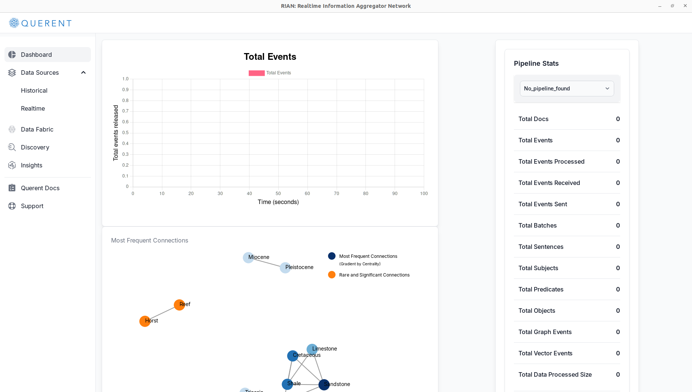
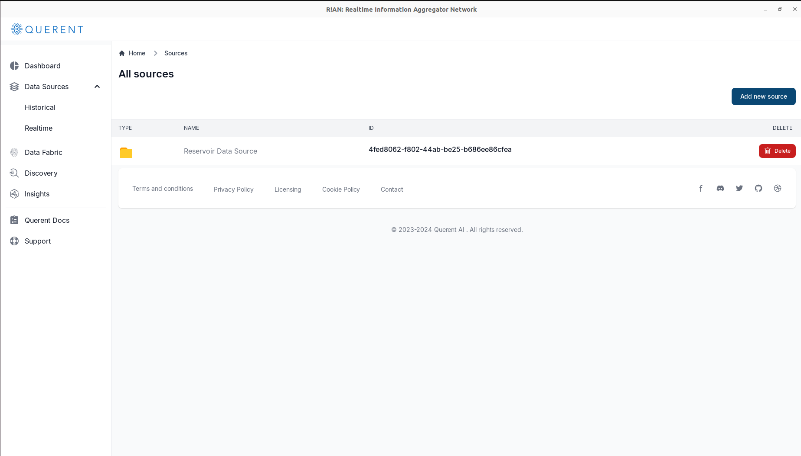
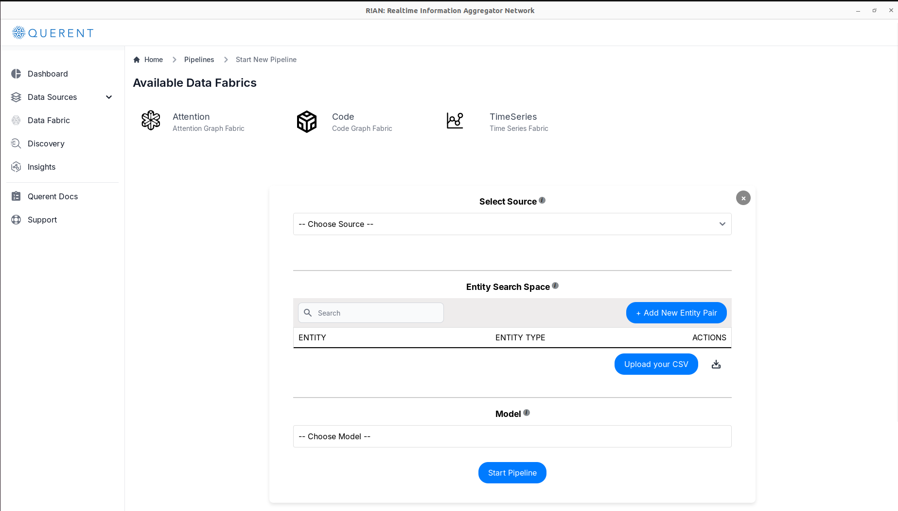
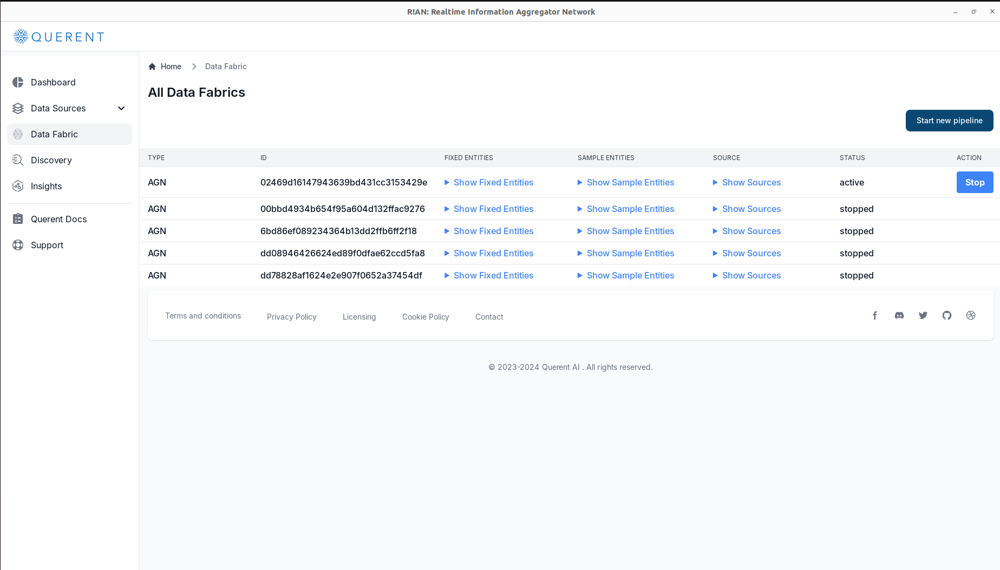
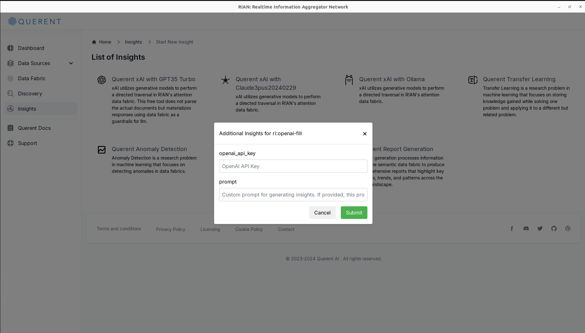
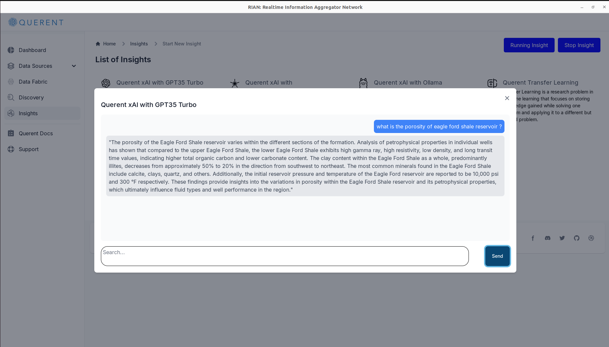

### Introduction 

Welcome to R!AN (Real-time Information Aggregator Network), a standalone application designed to build attention fabric for exploration geology. This guide will walk you through the steps to use R!AN effectively, from launching the application to utilizing its advanced features for data discovery and analysis.

### **Launching the Application**

When you first launch the R!AN application, you will see the Dashboard page, which provides an overview of the application's functionalities and real-time statistics.

#### Dashboard Overview
The Dashboard page is the main landing page of the R!AN application. It gives users a quick glance at the current status and key metrics of their data processing activities. The page is divided into several sections:

  

- **Total Events Graph**: A real-time graph showing the number of events released over time in seconds. This helps users monitor the activity and flow of data within the application.

- **Pipeline Stats**: A detailed summary of the data pipeline's status, including:

1. Total Documents processed
2. Total Events
3. Total Events Processed
4. Total Events Received
5. Total Events Sent
6. Total Batches
7. Total Sentences
8. Total Subjects
9. Total Predicates
10. Total Objects
11. Total Graph Events
12. Total Vector Events
13. Total Data Processed Size

- **Most Frequent Connections**: A visual data fabric representation of the connections within the dataset. This network digaram highlights significant and rare connections, providing insights into the underlying data relationships.

#### Navigating the Dashboard
The dashboard menu on the left side of the screen provides easy access to different features and data sources within the R!AN application:

- **Data Sources**: Add and explore both historical and real-time data inputs.
- **Data Fabric**: Initialize and create different types of data fabrics.
- **Discovery**: Perform data discovery tasks, such as running semantic searches and analyzing results.
- **Insights**: View generated insights based on your data.
- **Querent Docs**: Access the documentation and user guides for additional support.
- **Support**: Reach out for technical support or further assistance with using the application.

### **Adding a Data Source**
To begin analyzing your data with R!AN, you need to add a data source. Follow the steps below to select and configure your data input method:

1. **Navigate to Data Sources**:

- Go to the `Data Sources` section on the left-hand menu of the dashboard.

- Choose `Historical` to access the option for selecting your data input method.

2. **Add a New Data Source**: 

- Click on Add New Source to open the data source configuration options.

- Select `Local Storage` as your preferred method for adding data.

3. **Configure the Data Source**:

- Enter the Directory Path where your data is stored.
- Provide a unique name for this data source to easily identify it later.

4. **Verify the Added Data Source**: 

- Once the new data source is configured, verify that it has been added successfully to the list of available data sources. This will ensure that R!AN can access and process the data correctly.

### **Setting Up a Data Fabric**

To effectively manage and analyze your data, you need to set up a data fabric in R!AN. Follow these steps to configure your data fabric:

1. **Navigate to Data Fabric**:  
   - From the dashboard menu, click on `Data Fabric` to view and manage all available data fabrics.

2. **Start a New Pipeline**:  
   - Click on `Start New Pipeline` to initiate the process of creating a new data fabric pipeline.

3. **Select Data Fabric Type**:  
   - Under "Available Data Fabrics," choose the `Attention Data Fabric` option. This option will guide you through setting up a fabric that utilizes attention mechanisms for data analysis.

   

4. **Select Your Data Source(s)**:  
   - In the "Select Source" dropdown menu, choose the data source you previously added. This step links the data fabric to the data you want to analyze.

   

5. **Upload Entities or Enter Manually**:  
   - You have the option to upload a CSV file containing entities and their types, or manually enter each `entity` and `entity_type`. It is important to provide both `entity` and `entity_type`; partial data cannot be processed.

6. **Choose an NER Model (Optional)**:  
   - If you haven’t provided entities, you can choose an English-based Named Entity Recognition (NER) model from the "Model" dropdown menu. This model will automatically detect entities in your data.

   

7. **Start the Pipeline**:  
   - After configuring your data source and entities, click on `Start Pipeline` to begin processing. This action initiates the creation of the data fabric, allowing R!AN to process and analyze your data based on the specified parameters.

8. **Verify Pipeline Status**:  
   - Once the pipeline is started, you can monitor its status in the "Pipeline Status" section. Ensure the status is active and the data is being processed correctly.

   

9. **Ready for Discovery**:  
   - With the pipeline active, your data fabric is now ready for discovery. You can proceed to the `Discovery` section to explore insights and uncover hidden patterns within your data.

By following these steps, you can effectively set up and manage a data fabric in R!AN, facilitating powerful data analysis and discovery processes tailored to your specific needs.

### **Discovery: Exploring Your Data Fabric**

The **Discovery** feature in R!AN is designed to help users explore and understand the semantic connections within their data fabric. By using this tool, users can gain insights into the patterns and relationships present in their datasets.

#### **1. Initial Insights Generation**

When you first access the **Discovery** section, R!AN automatically generates some preliminary insights to help you get started. These insights provide a snapshot of the data's semantic structure and highlight both common and unique connections:

- **Rare Semantic Data Fabric Interactions**:  
  This insight identifies rare and potentially significant connections within your semantic data fabric. These rare interactions can uncover underlying patterns and dynamics that are otherwise difficult to detect.

- **Diverse Semantic Data Fabric Interactions**:  
  This insight focuses on documents or data points that exhibit a rich diversity of semantic connections. These connections span across a wide range of topics, showcasing the depth and breadth of the data fabric.

#### **2. Performing Discovery Queries**

After reviewing the initial insights, users can delve deeper into their data fabric by sending custom queries:

- **Enter a Query**:  
  Use the search bar at the top of the **Discovery** page to type in your query. This query can be a phrase, or a more complex request designed to explore specific aspects of the data fabric.

- **Select Search Method**:  
  - **Retriever-Based Search** (available in the freemium version): Converts the user's query into contextually aware embeddings and searches the data fabric to return the top 10 unique results that best match the query. This method is useful for quick searches that need relevant results without deep analysis.
  - **Traverser-Based Search** (available in the Pro version): This method goes beyond simple retrieval, allowing users to traverse the connections within the data fabric. It is ideal for complex queries that require an understanding of relationships between entities.

#### **3. Viewing and Navigating Search Results**

The Discovery tool displays search results in a paginated format, making it easy to browse and analyze:

- **Paginated Results**:  
  The initial search results display the top 10 matches. Users can click "Next" to view subsequent sets of results, allowing for a comprehensive exploration of the data fabric.

- **Result Interactions**:  
  Each result provides options to further interact with the data, such as viewing the source document or exploring the semantic tags associated with each finding. This interactive approach allows users to gain deeper insights and refine their queries as needed.

By utilizing the Discovery feature, users can explore their data fabric more effectively, identify significant patterns, and derive actionable insights to support their decision-making process.

### **Insights: Generating Deeper Understanding from Your Data Fabric**

The **Insights** feature in R!AN provides users with advanced tools to interact with and derive valuable information from their data fabric. This feature allows users to utilize different models and techniques to generate meaningful insights tailored to their specific needs.

#### **1. Selecting the Type of Insight**

To generate meaningful insights, users first need to select the type of insight they wish to explore. R!AN offers a range of options designed to cater to various analytical needs:

- **Querent xAI**: This insight leverages generative models to conduct a directed traversal within R!AN's attention data fabric. Instead of directly parsing documents, it generates responses by using the data fabric as a guide for the language model. This approach ensures more accurate and contextually relevant outputs. Currently, there are three options available under Querent xAI:
  - **OpenAI**: Requires an API key from the OpenAI platform.
  - **Claude**: Also requires an API key, available through the Claude platform.
  - **OLLAMA**: An open-source option where users can set up their own LLM (Large Language Model) server. This option is ideal for those who prefer a self-hosted solution.

Other types of insights available include:
- **Querent Transfer Learning**: Applies knowledge acquired from solving one problem to a different but related problem, enhancing the adaptability of models across diverse use cases.
- **Querent Anomaly Detection**: Detects unusual patterns or outliers within data fabrics, crucial for applications like fraud detection or predictive maintenance.
- **Querent Cross Document Summarization**: Synthesizes information from multiple documents to create a unified summary, highlighting key insights and themes from various sources.
- **Querent Report Generation**: Produces detailed reports based on the semantic data fabric, summarizing essential insights, trends, and patterns across the dataset.

   

#### **2. Using Querent xAI with GPT35 Turbo**

For this example, we will demonstrate how to use the **Querent xAI with GPT35 Turbo**:

- **Initiate the Insight**: Start by selecting "Querent xAI with GPT35 Turbo" from the list of insights. This will open a chat modal, allowing the user to interact directly with the data fabric.
  1. **API Key Requirement**: Users need to provide their OpenAI API key since the system does not include one by default.
  2. **Custom Prompt (Optional)**: Users can also enter a custom prompt, which will replace the default prompt used to generate the response to the user’s query.

  

- **Interacting with the Data Fabric**: Within the chat modal, users can input natural language queries to engage with the data fabric. The generative AI model will navigate the data fabric according to the user's query and produce a natural language response. For example, if a user inquires, "What is the porosity of the Eagle Ford Shale reservoir?" the system will analyze relevant data points within the fabric and provide a detailed answer based on the available data.

  

By utilizing these insight tools, users can unlock the full potential of their data, uncover hidden patterns, and make more informed decisions.

