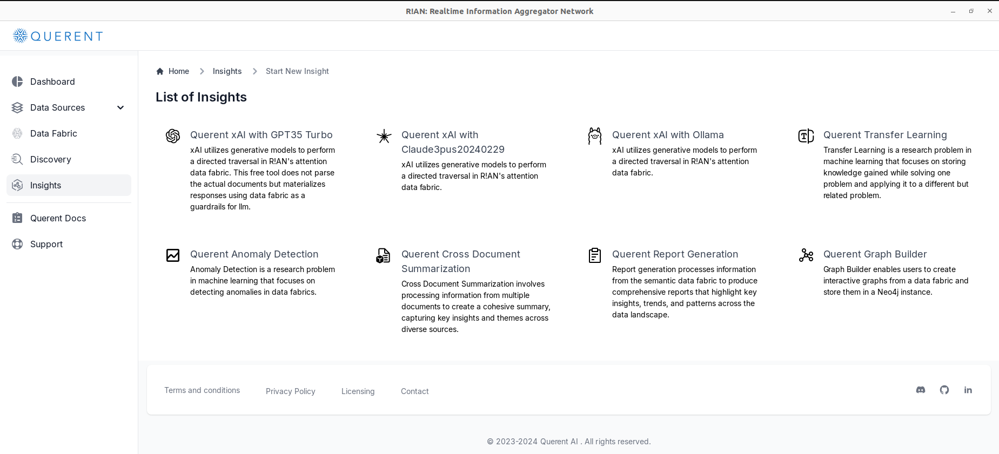
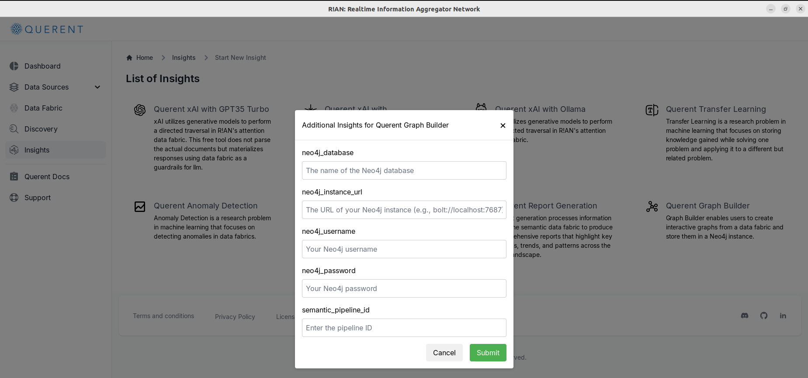
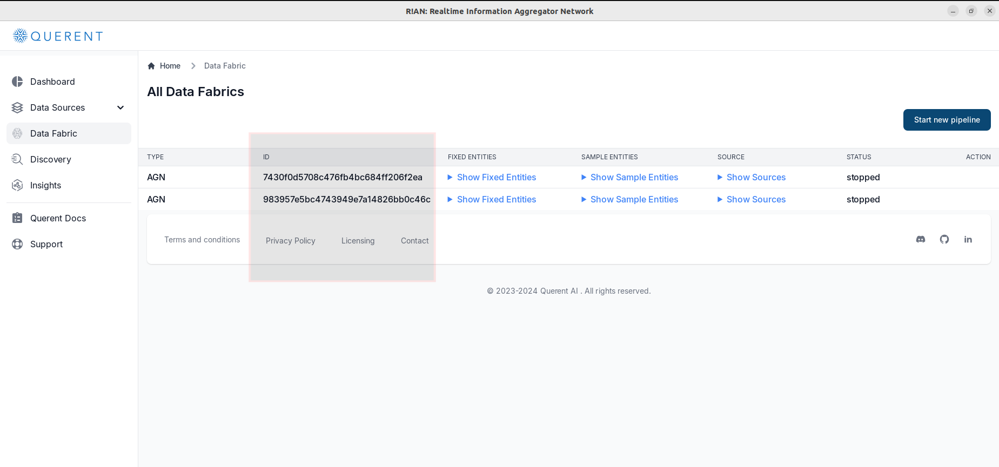
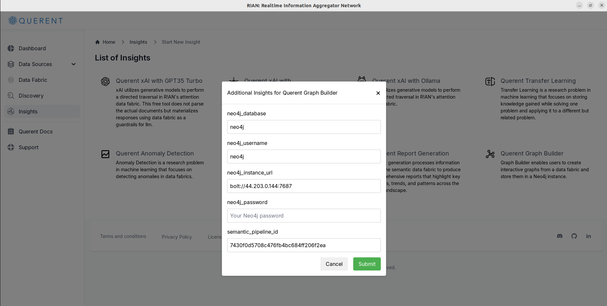
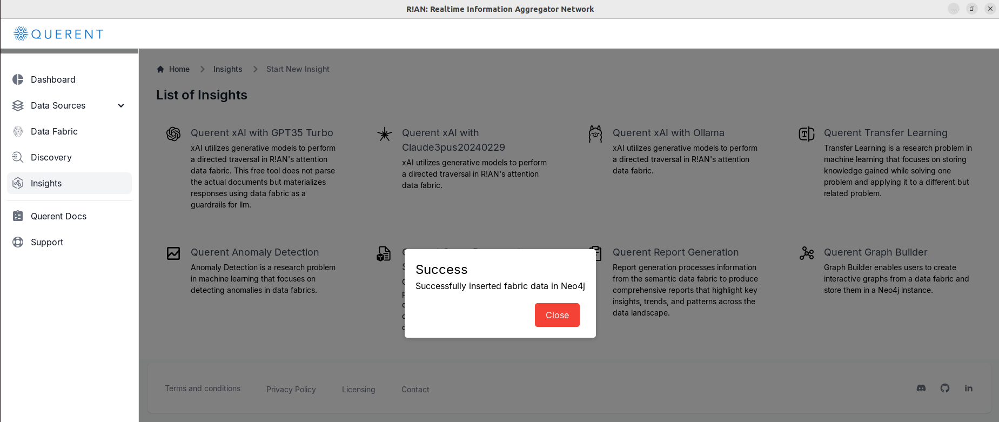
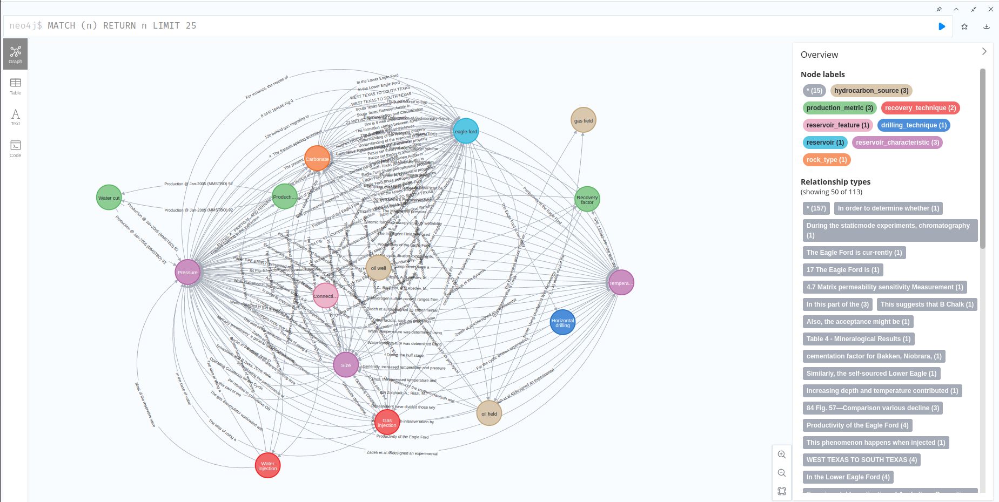

## Introduction

Welcome to the **Graph Builder** tutorial! The Graph Builder is a powerful tool within **R!AN** that allows you to create interactive visualizations of your data fabric. By representing your data fabric graphically, you can:

- **Run Graph Queries**: Explore your data using graph database query languages like Cypher.
- **Train Graph Neural Networks (GNNs)**: Use graph data to train advanced machine learning models.
- **Gain Deeper Insights**: Uncover hidden patterns and relationships within your data.

This tutorial will guide you through the steps to effectively use the Graph Builder and visualize your data in Neo4j.

## **Prerequisites**

Before you begin, ensure that you have:

- Completed the initial setup of R!AN.
- Added at least one data source.
- Created a data fabric using the steps outlined in the [Getting Started Guide](../get-started/standalone_application_guide.md).
- Access to a Neo4j instance (local or remote) where the graph will be visualized.

## **Accessing the Graph Builder**

Follow these steps to access the Graph Builder within R!AN:

1. **Navigate to Insights**:

   - Click on **Insights** in the left-hand menu.

     

2. **Select Graph Builder**:

   - From the list of available insights, select**Graph Builder**.

     

## Building Your First Graph

### Step 1: Select Data Fabric

- **Enter the Data Fabric ID**:

  - In the **Data Fabric ID** field, enter the ID of the data fabric you wish to visualize.
  - You can retrieve the Data Fabric ID from the **Data Fabric** section.

    

### Step 2: Configure Neo4j Connection Parameters

To export your data fabric to a Neo4j graph database, provide the connection details of your Neo4j instance.

- **Enter Neo4j Connection Details**:

  - **Username**: Enter your Neo4j username (default is usually `neo4j`).
  - **Password**: Enter your Neo4j password.
  - **Database Name**: Specify the Neo4j database name where you want to import the graph (default is `neo4j`).
  - **Instance URL**: Provide the Bolt protocol URL of your Neo4j instance (e.g., `bolt://localhost:7687`).

    

  **Note**: Ensure that your Neo4j instance is running and accessible from your machine.

### Step 3: Generate Graph

- **Submit the Configuration**:

  - Click on the **Submit** button to start exporting your data fabric to Neo4j.
  - R!AN will process your data fabric and load it into the specified Neo4j database.

- **Monitor Progress**:

  - A confirmation message will appear showing the status of the export.

  

## Visualizing Your Graph in Neo4j

After exporting, you can navigate to your Neo4j instance to visualize and interact with the graph.

1. **Open Neo4j Browser**:

   - Launch the Neo4j Browser application.

2. **Log In to Neo4j**:

   - Enter your Neo4j **Username** and **Password** as provided earlier.

3. **Explore the Graph**:

   - Use Neo4j's query language, **Cypher**, to interact with your graph.
   - For a quick visualization, run the following query in the command line at the top:

     ```cypher
     MATCH (n)-[r]->(m) RETURN n, r, m LIMIT 25
     ```

   - This query retrieves nodes and relationships from your graph and displays them visually.

     

4. **Interact with the Graph**:

   - **Zoom and Pan**: Navigate through different areas of the graph.
   - **Node Details**: Click on nodes to view their properties and relationships.
   - **Search**: Use the search functionality to find specific nodes or patterns.


## Conclusion

By leveraging the Graph Builder, you can transform complex data fabrics into intuitive visualizations within Neo4j. This enables you to:

- **Identify Key Entities and Relationships**: Quickly spot important nodes and how they are connected.
- **Uncover Hidden Patterns**: Discover relationships and trends not immediately apparent in raw data.
- **Perform Advanced Analytics**: Utilize graph algorithms and query capabilities.
- **Train GNN Modules**: Use your graph data to train Graph Neural Networks for predictive modeling and insights.


**Next Steps**:

- **Deepen Your Neo4j Knowledge**:

  - Explore Neo4j's [official documentation](https://neo4j.com/docs/) to learn advanced querying and graph analysis techniques.

- **Integrate with Machine Learning Tools**:

  - Export your graph data for use with GNN frameworks like [PyTorch Geometric](https://pytorch-geometric.readthedocs.io/) or [DGL](https://www.dgl.ai/).

