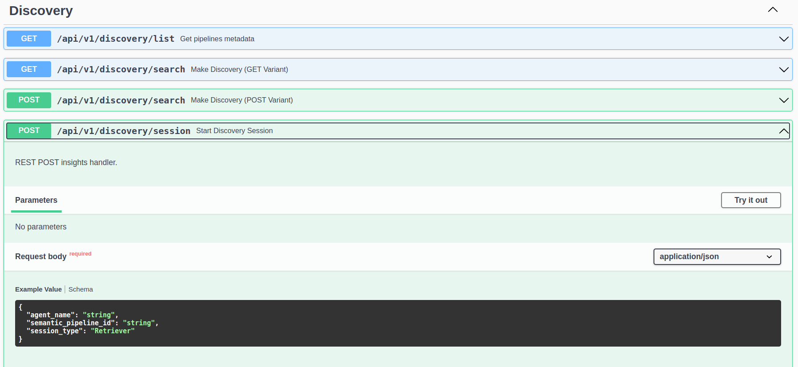

import Tabs from '@theme/Tabs';
import TabItem from '@theme/TabItem';

This guide provides an overview of data discovery and insight generation in R!an, how it differs from traditional methods, and its benefits. 

## Data Discovery with R!an

1. **Contextually Aware Embeddings**: R!an uses contextually aware embeddings to create a semantic data fabric. These embeddings, called as knowledge vectors, capture the semantic meaning of data by understanding the context in which data appears, enabling more accurate and meaningful insights.

2. **Knowledge Integration**: Unlike traditional data discovery, which focuses on raw data, R!an uses knowledge vectors that also act as pointers to relevant context and file in which the contesxt appears.

3. **Enhanced Insight Generation**: By utilizing semantic data fabric, R!an can uncover complex relationships and patterns within the data.

4. **Scalability**: R!an is designed to handle large volumes of data efficiently, making it suitable for enterprise-level data discovery. Its scalable architecture ensures that it can process and analyze vast amounts of data without compromising performance. Please refer to [performance report](../overview/performance_report.md) for more information.


There are 2 types of data discovery available to the users. 

  ### 1. Data Fabric-Enabled Search

  Users can perform similarity searches on the semantic data fabric to find relevant documents and context using a natural language query. Here’s how to do it:

  1. **Start Discovery Session**

  

  <br>

  2. **Customize the Options**

  ```json
          {
      "agent_name": "string",
      "semantic_pipeline_id": "string",
      "session_type": "Retriever"
    }
  ```

  - agent_name: A custom name for your discovery session. 
  - semantic_pipeline_id: The semantic_pipeline_id which is recieved as the reposne to the starting a semantic data service. Please refer to [Quickstart - Create Semantic Data Fabric](../get-started/quickstart-2.md).
  - session_type: `Retriever` will configure the discovery session to enable similarity searches over the semantic data fabric.


    This approach is highly useful when dealing with thousands of files, as it essentially creates pointers to knowledge, making it easy to retrieve relevant information efficiently.


## Conclusion


---

This document outlines the benefits and process of data discovery with R!an, providing a comprehensive guide to utilizing its advanced capabilities for generating meaningful knowledge embeddings.