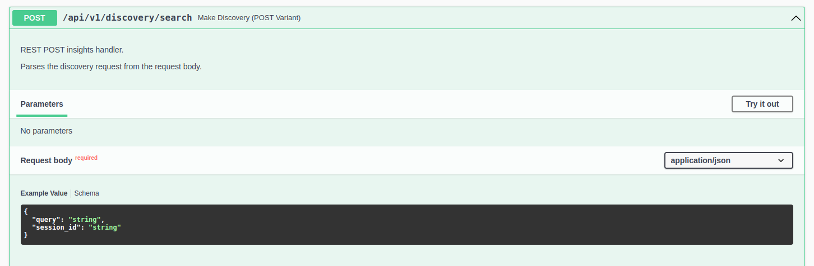

import Tabs from '@theme/Tabs';
import TabItem from '@theme/TabItem';

This guide provides an overview of data discovery and insight generation in R!an, how it differs from traditional methods, and its benefits. 

## Data Discovery with R!an

1. **Contextually Aware Embeddings**: R!an uses contextually aware embeddings to create a semantic data fabric. These embeddings, called as knowledge vectors, capture the semantic meaning of data by understanding the context in which data appears, enabling more accurate and meaningful insights.

2. **Knowledge Integration**: Unlike traditional data discovery, which focuses on raw data, R!an uses knowledge vectors that act as pointers to relevant context and file in which the contesxt appears. This integration allows for deeper and more comprehensive insights.

3. **Enhanced Insight Generation**: By utilizing semantic data fabric, R!an can uncover complex relationships and patterns within the data, leading to more actionable insights.

4. **Scalability**: R!an is designed to handle large volumes of data efficiently, making it suitable for enterprise-level data discovery. Its scalable architecture ensures that it can process and analyze vast amounts of data without compromising performance. Please refer to [performance report](../overview/performance_report.md) for more information.


  There are two types of data discovery available to the users:

  ### 1. Data Fabric-Enabled Search

  Users can perform similarity searches on the semantic data fabric to find relevant documents and context using a natural language query. Here’s how to do it:

  - **Start Discovery Session**

  

  <br>

  - **Customize the Options**

    ```json
      {
        "agent_name": "string",
        "semantic_pipeline_id": "string",
        "session_type": "Retriever"
      }
    ```

    - agent_name: A custom name for your discovery session. 
    - semantic_pipeline_id: The semantic_pipeline_id recieved as the reponse to the starting a semantic data service. Please refer to [Quickstart - Create Semantic Data Fabric](../get-started/quickstart-2.md).
    - session_type: User can choose from the below options. For more information refer to [Conceptual Overview: Retriever-Based Search vs. Traverser-Based Search document.](../guides/retriever_traversar_review.md) :
      1. `Retriever`: Configures the discovery session to enable similarity searches over the semantic data fabric.
      2. `Traverser`: Configures the discovery session to enable graph-traversal based searches over the semantic data fabric.
  
  Once the customization section is complete and the user starts a discovery session, a unique `discovery_session_id` is returned. This session ID is unique because it signifies a session created by an expert who understands the domain and is asking relevant questions from their data. This process helps in downstream tasks such as generating insights from the focused or discovered data, running Graph Neural Networks (GNN), fine-tuning models, etc., on the discovered data.

  - **Search the Semantic Data Fabric**
  
  
  <br>

  ```json
    {
  "query": "string",
  "session_id": "string"
    }
    ```
  - query: Your search query in natural language.
  - session_id: The unique discovery_session_id received after customizing and starting the discovery session.

  - **Discovery Results**
    1. Retrieve Similarity Results
       In a retriever-type discovery session, the system will fetch the top 10 results that are most similar to the user's query. The results will be formatted as follows:
      ```json
      {
        "insights": [
          {
            "document": "string",
            "relationship_strength": "string",
            "sentence": "string",
            "source": "string",
            "tags": "string"
          }
        ],
        "query": "string",
        "session_id": "string"
      }
      ```
    Each result in the insights array will have the following fields:

      - document: The identifier or name of the document where the relevant sentence is found.
      - relationship_strength: The strength of the relationship between the tagged entities in the sentence. This is determined by the attention score between the entity pairs, using attention matrices from a transformer based model.
      - sentence: The actual sentence from the document that is relevant to the query.
      - source: The source of the document, such as a file path or URL.
      - tags: head and tail tags associated with the sentence.

    If the user asks the same query again, the system will retrieve the next 10 best results based on similarity.


## Conclusion


---

This document outlines the benefits and process of data discovery with R!an, providing a comprehensive guide to utilizing its advanced capabilities for generating meaningful knowledge embeddings.