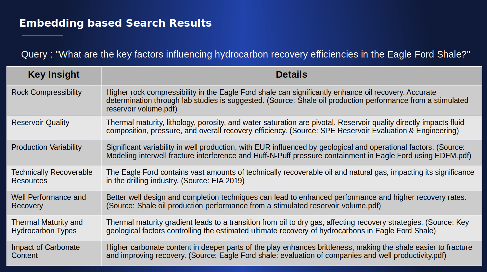
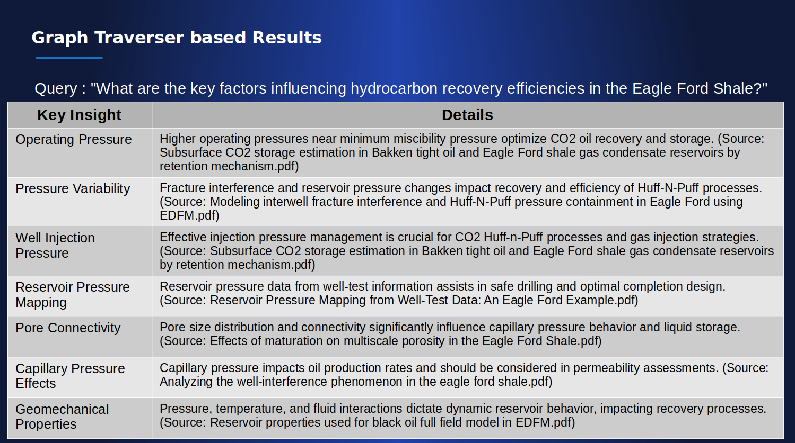

import Tabs from '@theme/Tabs';
import TabItem from '@theme/TabItem';

This guide provides an overview of data discovery and insight generation in R!an, how it differs from traditional methods, and its benefits. 

## Data Discovery with R!an

1. **Contextually Aware Embeddings**: R!an uses contextually aware embeddings to create a semantic data fabric. These embeddings, called as knowledge vectors, capture the semantic meaning of data by understanding the context in which data appears, enabling more accurate and meaningful insights.

2. **Knowledge Integration**: Unlike traditional data discovery, which focuses on raw data, R!an uses knowledge vectors that act as pointers to relevant context and file in which the contesxt appears. This integration allows for deeper and more comprehensive insights.

3. **Enhanced Insight Generation**: By utilizing semantic data fabric, R!an can uncover complex relationships and patterns within the data, leading to more actionable insights.

4. **Scalability**: R!an is designed to handle large volumes of data efficiently, making it suitable for enterprise-level data discovery. Its scalable architecture ensures that it can process and analyze vast amounts of data without compromising performance. Please refer to [performance report](../overview/performance_report.md) for more information.


  There are two types of data discovery available to the users:

  ### 1. Data Fabric-Enabled Search

  Users can perform similarity searches on the semantic data fabric to find relevant documents and context using a natural language query. Here’s how to do it:

  - **Start Discovery Session**

  

  <br />

  - **Customize the Options**

  ```json
    {
      "agent_name": "string",
      "semantic_pipeline_id": "string",
      "session_type": "Retriever"
    }
  ```

  - agent_name: A custom name for your discovery session. 
  - semantic_pipeline_id: The semantic_pipeline_id recieved as the reponse to the starting a semantic data service. Please refer to [Quickstart - Create Semantic Data Fabric](../get-started/quickstart-2.md).
  - session_type: User can choose from the below options. For more information refer to [Conceptual Overview: Retriever-Based Search vs. Traverser-Based Search document.](../guides/retriever_traversar_review.md) :
    1. `Retriever`: Configures the discovery session to enable similarity searches over the semantic data fabric.
    2. `Traverser`: Configures the discovery session to enable graph-traversal based searches over the semantic data fabric.
  
  Once the customization section is complete and the user starts a discovery session, a unique `discovery_session_id` is returned. This session ID is unique because it signifies a session created by an expert who understands the domain and is asking relevant questions from their data. This process helps in downstream tasks such as generating insights from the focused or discovered data, running Graph Neural Networks (GNN), fine-tuning models, etc., on the discovered data.

  - **Search the Semantic Data Fabric**
  

  <br />

  ```json
    {
  "query": "string",
  "session_id": "string"
    }
  ```
  - query: Your search query in natural language.
  - session_id: The unique discovery_session_id received after customizing and starting the discovery session.

  - **Discovery Results**
      
      The results will be formatted as follows:
      ```json
      {
        "insights": [
          {
            "document": "string",
            "relationship_strength": "string",
            "sentence": "string",
            "source": "string",
            "tags": "string"
          }
        ],
        "query": "string",
        "session_id": "string"
      }
      ```
    Each result in the insights array will have the following fields:

      - document: The identifier or name of the document where the relevant sentence is found.
      - relationship_strength: The strength of the relationship between the tagged entities in the sentence. This is determined by the attention score between the entity pairs, using attention matrices from a transformer based model.
      - sentence: The actual sentence from the document that is relevant to the query.
      - source: The source of the document, such as a file path or URL.
      - tags: head and tail tags associated with the sentence.


  1. **Retrieve Similarity Results**
      
      In a retriever-type discovery session, the system will fetch the top 10 results that are most similar to the user's query. If the user asks the same query again, the system will retrieve the next 10 best results based on similarity.
      
      As an example this section shows the results of retriever-based discovery session for the query: "What are the key factors influencing hydrocarbon recovery efficiencies in the Eagle Ford Shale?". A document corpus of 1000 research documents from different reservoirs around the world was used for this:

     
     <br />

      Key Highlights of Retriever-Based Search:

      - Relevant Documents and Sources: The retriever-based search was able to identify documents and sources directly related to the query, such as high rock compressibility and reservoir quality.
      - Direct Answers: The search results provided exact sentences from documents that specifically answer the query, offering clear and direct insights into factors like thermal maturity, lithology, and production variability.
      - Contextual Relevance: By using contextually aware embeddings, the retriever-based search could surface highly relevant information that accurately addressed the query.


  2. **Graph Traversal Results**
      
      In a traverser-type discovery session, the system allows for a more interconnected and context-aware exploration of the data, revealing complex relationships and patterns that traditional search methods might miss. It's particularly valuable for tasks requiring a comprehensive understanding of intricate data relationships, such as research, intelligence analysis, or complex problem-solving scenarios.

      The algorithm first identifies the top searches based on the user's query, similar to the retriever-type session and then analyzes entity relationships from search results, creating a dynamic, interconnected view of the information. It then explores these connections, tracing paths between related entities to reveal insights that might not be apparent from individual documents alone.

      What sets this method apart is its ability to maintain context across multiple queries within a session. The system builds upon previous searches, continuously refining its understanding of the user's intent and the relationships within the data. This results in a more nuanced, comprehensive exploration of the semantic data fabric.

      
      <br />

      Key Highlights of Traverser-Based Search:

        - Interconnected Insights: The traverser-based search provided more interconnected and detailed information, such as capillary pressure effects and geomechanical properties, which may not have been immediately apparent in the retriever-based search.
        - Deeper Understanding: By exploring relationships between entities, the traverser-based search uncovered deeper connections within the data, offering a more holistic understanding of factors influencing hydrocarbon recovery.
        - Complex Relationships: This method revealed additional factors like well injection pressure and reservoir pressure mapping, showcasing the interconnected nature of various elements affecting recovery efficiencies.
      


## Conclusion
  Both retriever-based and traverser-based searches have unique strengths.
  
  Retriever-Based Search: Ideal for quickly finding relevant documents and specific answers using contextually aware embeddings. It excels in providing direct, contextually relevant information based on the query.
  
  Traverser-Based Search: Builds on retriever-based search by exploring complex relationships within the data. It offers deeper insights and a more comprehensive understanding of the interconnected factors affecting the query topic.


---

This document outlines the benefits and process of data discovery with R!an, providing a comprehensive guide to utilizing its advanced capabilities for generating meaningful knowledge embeddings.