### Introduction 

Welcome to R!AN (Real-time Information Aggregator Network), a standalone application designed to help you build a data fabric for exploration geology or any other domain-specific data. This guide will walk you through the steps to effectively use R!AN, from launching the application to utilizing its advanced features for data discovery and analysis.

### **Launching the Application**

After installing R!AN, launch the R!AN application to get started. You will see the Dashboard page, which provides an overview of the application's functionalities and real-time statistics.

#### Dashboard Overview
The Dashboard is your main hub in R!AN, giving you a quick glance at the status of your data processing activities. It is divided into several sections:

  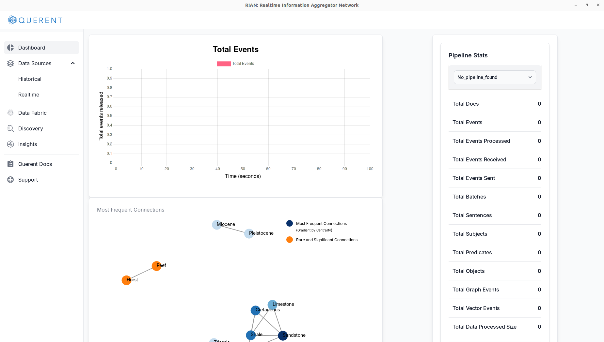

- **Total Events Graph**: Displays a real-time graph showing the number of events processed over time, helping you monitor data flow within the application.

- **Pipeline Stats**: Summarizes key metrics of your data pipeline, including:

1. Total Documents processed
2. Total Events
3. Total Events Processed
4. Total Events Received
5. Total Events Sent
6. Total Batches
7. Total Sentences
8. Total Subjects
9. Total Predicates
10. Total Objects
11. Total Graph Events
12. Total Vector Events
13. Total Data Processed Size

- **Most Frequent Connections**: Provides a visual representation of the most significant and rare connections within your dataset, offering insights into underlying data relationships.

#### Navigating the Dashboard
Use the left-hand menu to access R!AN's features:

- **Data Sources**:  Add and manage data inputs.
- **Data Fabric**: Create and manage different types of data fabrics.
- **Discovery**: Explore your data through semantic searches and analysis.
- **Insights**: Generate deeper insights from your data.
- **Querent Docs**: Access user guides and support.
- **Support**: Reach out for technical assistance.

### **Adding a Data Source**
To begin analyzing your data with R!AN, you'll need to add a data source. Follow these steps:

1. **Navigate to Data Sources**:

- Click on `Data Sources` in the left-hand menu.

- Select `Historical` to add a data source.

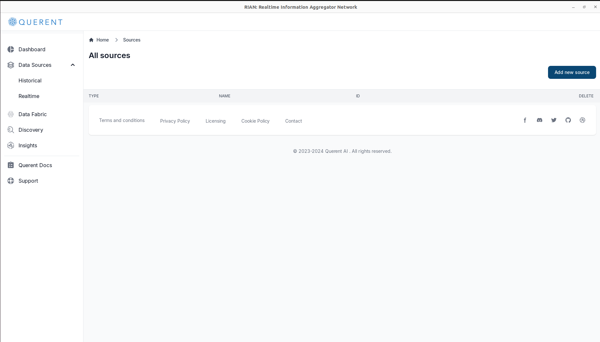

2. **Add a New Data Source**: 

- Click on Add New Source.

- Choose `Local Storage` as your data input method.

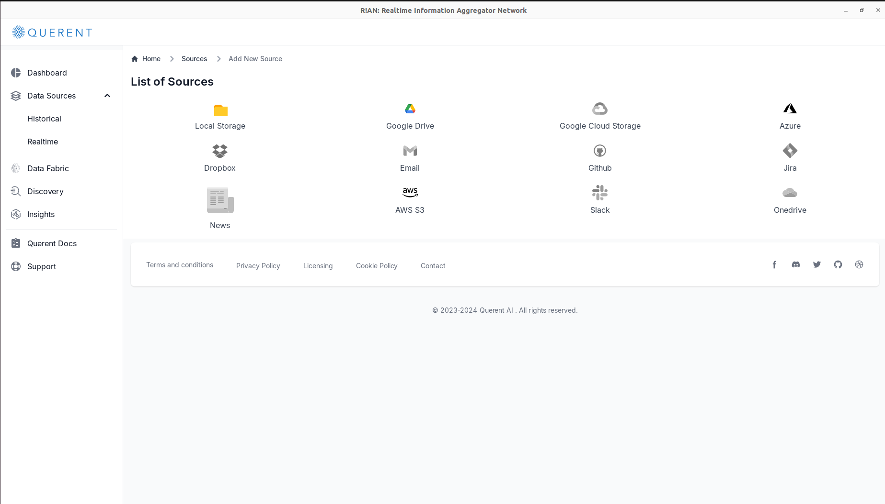

3. **Configure the Data Source**:

- Enter the `Directory Path` where your data is stored.
- Provide a unique `Name` for the data source for easy identification.

4. **Verify the Added Data Source**: 

- Ensure that your new data source appears in the list of available sources.

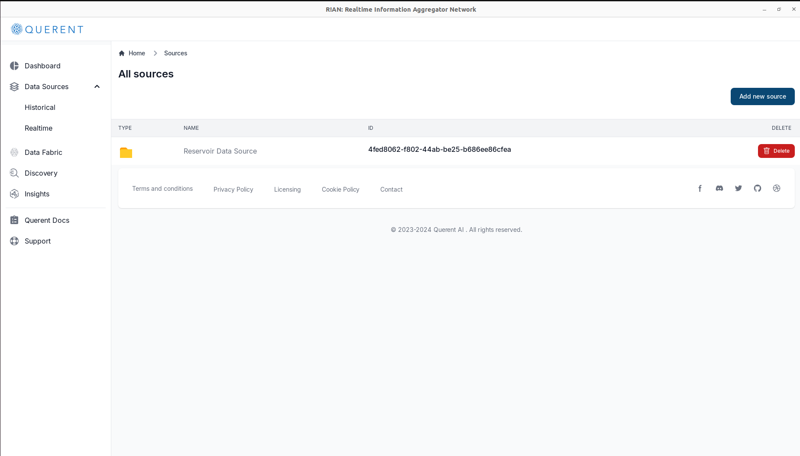

### **Setting Up a Data Fabric**

With your data source added, you can now set up a data fabric to manage and analyze your data.

1. **Navigate to Data Fabric**:  
   - Click on `Data Fabric` in the left-hand menu.

2. **Start a New Pipeline**:  
   - Click on `Start New Pipeline` to create a new data fabric pipeline.

3. **Select Data Fabric Type**:  
   - Choose `Attention Data Fabric` from the available options.

   

4. **Select Your Data Source(s)**:  
   - In the "Select Source" dropdown menu, choose the data source you added earlier.

   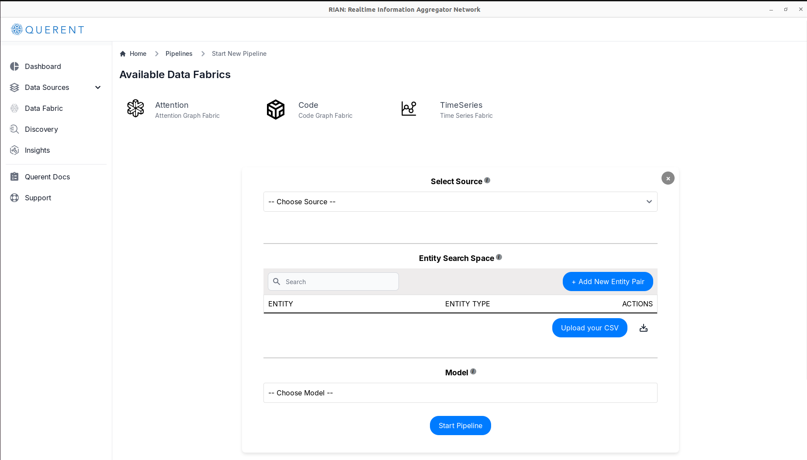

5. **Add Entities/Concepts**:

   - **Option 1**: Upload a CSV file containing `entity` and `entity_type`.
   - **Option 2**: Manually enter each `entity` and `entity_type`.

     *Note: Both `entity` and `entity_type` are required for processing.*

6. **Choose an NER Model (Optional)**:  
   - If you haven't provided entities, select a Named Entity Recognition (NER) model to automatically detect entities in your data.

   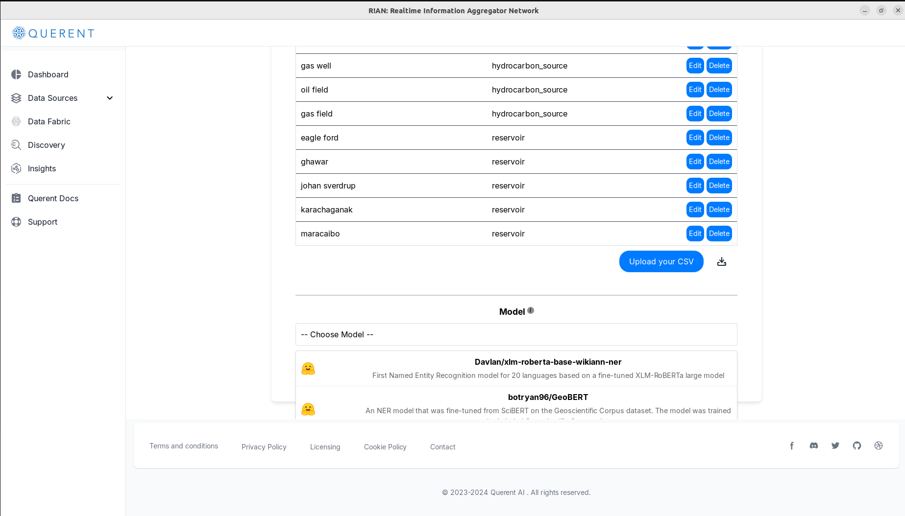

7. **Start the Pipeline**:  
   - Click on `Start Pipeline` to begin processing your data.

8. **Monitor Pipeline Status**:  
   - Check the `Pipeline Status` section to ensure your pipeline is active and processing data.

   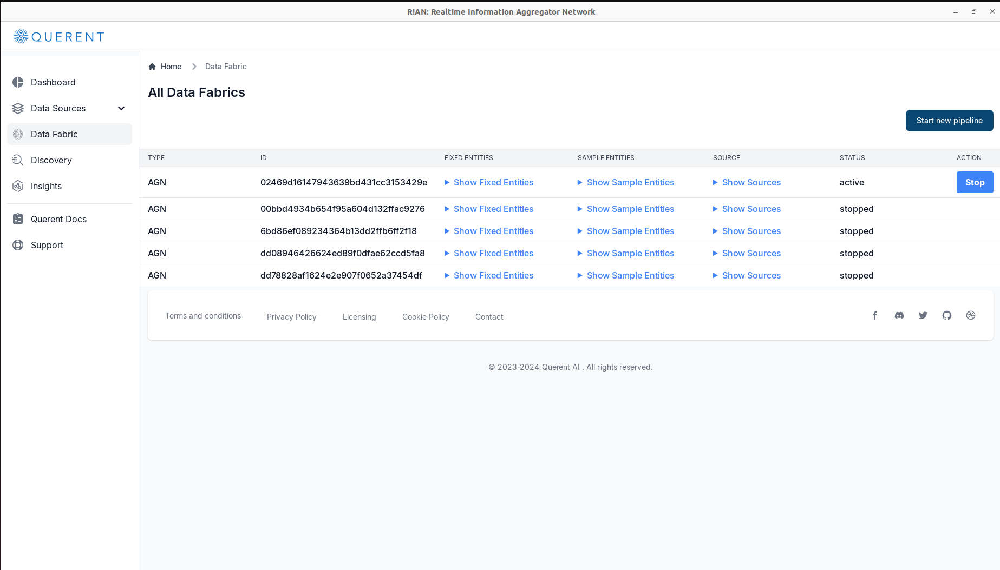

9. **Optionally Monitor Pipeline Status on Dashboard**:  
   - Check the `Pipeline Stats` section and 'Total Events' graph to observe pipeline stats.

   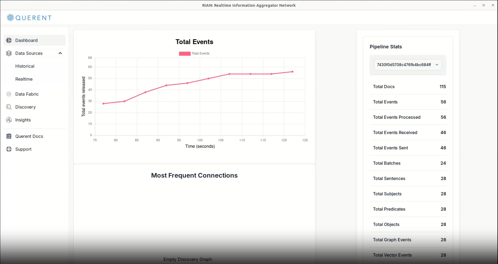

10. **Proceed to Discovery**:  
   - With the pipeline running, your data fabric is ready for exploration.

### **Discovery: Exploring Your Data Fabric**

The **Discovery** feature allows you to explore and understand the semantic connections within your data fabric.

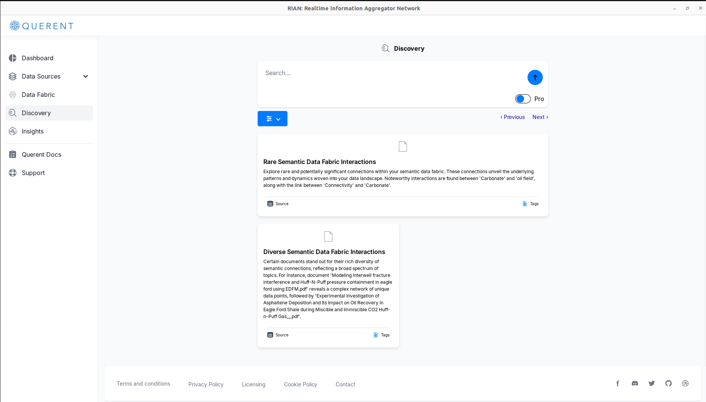

#### **Initial Insights**

Upon accessing the **Discovery** section, R!AN generates preliminary insights:

- **Rare Semantic Data Fabric Interactions**:  
   Highlights rare and potentially significant connections in your data.

- **Diverse Semantic Data Fabric Interactions**:  
  Showcases documents with a wide range of semantic connections.

#### **Performing Discovery Queries**

Dive deeper by sending custom natural language queries:

- **Enter a Query**:  
  Use the search bar to type a query or phrase relevant to your analysis.

- **Select Search Method**:  
  - **Retriever-Based Search** (Freemium): Converts the user's query into contextually aware embedding and searches the data fabric to return search results that best match the query.

  - **Traverser-Based Search** (Pro): Allows traversal of connections for complex queries requiring an understanding of data fabric.

#### **Viewing and Navigating Results**

- **Paginated Results**:  
  Browse through results using the pagination controls.

- **Result Interactions**:  
  View source documents or explore semantic tags associated with each result.

### **Insights: Generating Deeper Understanding from Your Data Fabric**

The **Insights** feature provides advanced tools to derive valuable information from your data fabric.

#### **Selecting the Type of Insight**

(Freemium) Choose from various insight types tailored to your analytical needs:

- **Querent xAI**: Leverages generative models to interact with your data fabric.
  - **Option**:
    - **OpenAI**: Requires an OpenAI API key.
    - **Claude**: Requires a Claude API key.
    - **OLLAMA**: An open-source option for self-hosted large language models (LLMs).

- **Querent Graph Builder**: Saves data fabric in a neo4j instance.

(Pro) Other types of insights available include:

- **Querent Transfer Learning**: Applies knowledge from one problem to another.

- **Querent Anomaly Detection**: Identifies unusual patterns or outliers.

- **Querent Cross Document Summarization**: Summarizes information from multiple documents.

- **Querent Report Generation**: Generates detailed reports based on your data.

   

#### **Using Querent xAI with GPT35 Turbo**
As an example, let's use Querent xAI with GPT-3.5 Turbo:

1. **Initiate the Insight**:

   - Select **Querent xAI with GPT-3.5 Turbo**.

     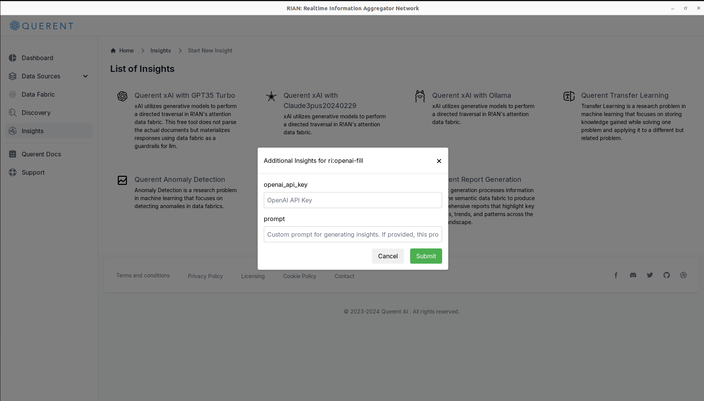

2. **Provide API Key**:

   - Enter your OpenAI API key when prompted.

3. **(Pro) Enter a Custom Prompt**:

   - Provide a custom prompt to guide the model's response if desired.

4. **Interact with the Data Fabric**:

   - Use the chat interface to ask questions in natural language.

     **Example Query**: "What is the porosity of the Eagle Ford Shale reservoir?"

     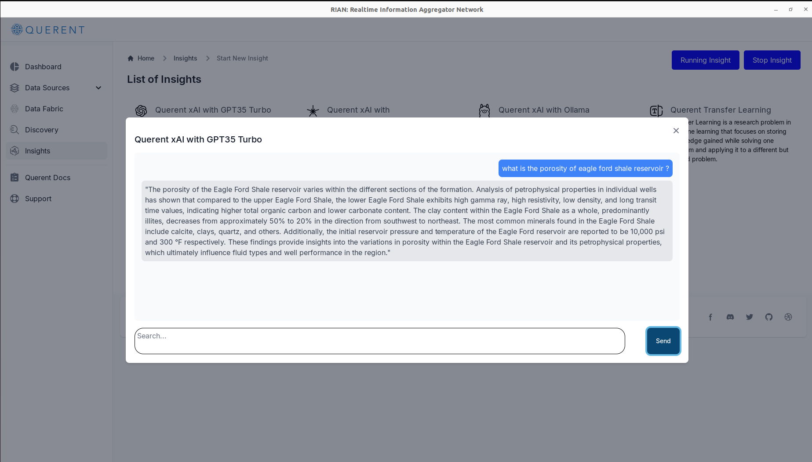

   - The model will analyze your data fabric and provide a detailed answer based on the available data.

By leveraging these insight tools, you can unlock the full potential of your data, uncover hidden patterns, and make informed decisions.

## Conclusion

You've now learned how to use R!AN to build an attention fabric, explore your data, and generate valuable insights. Whether you're working in exploration geology or any other field, R!AN empowers you to harness the power of your data for better analysis and decision-making.

