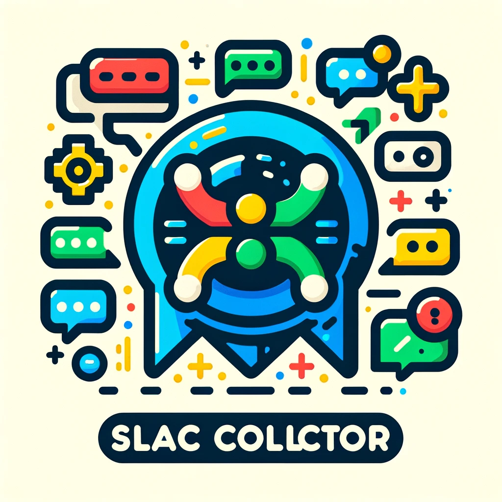
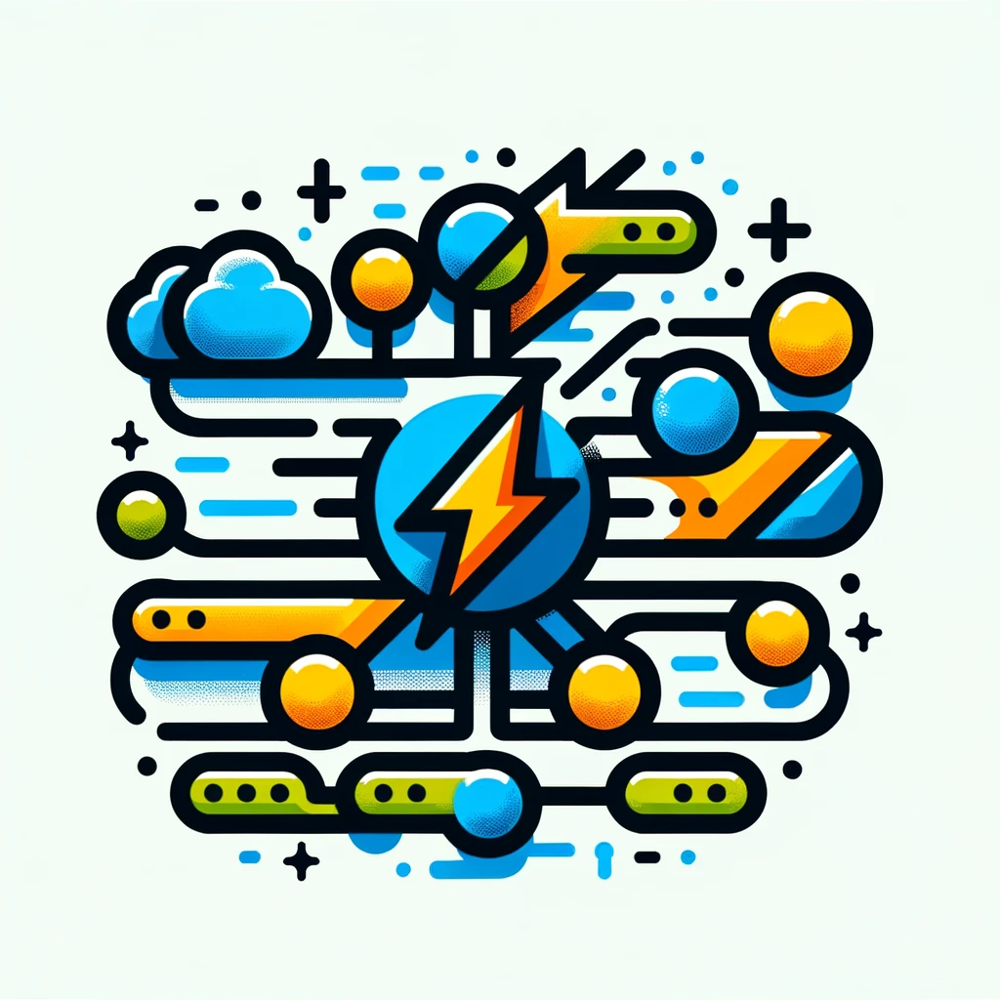
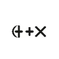

## Overview

This guide outlines the different collectors available within the Querent Node, detailing the required configuration properties for each. Collectors are integral for gathering data from various sources to be processed and analyzed by the Querent Node.

## Supported Sources

           

### Azure Blob Storage Collector

- **Type:** `AzureCollectorConfig`
- **Required Fields:**
  - `connection_string` - The Azure storage account connection string.
  - `account_url` - The URL of the Azure storage account.
  - `credentials` - Credentials used for authentication.
  - `container` - The name of the Azure Blob Storage container.

### Google Cloud Storage (GCS) Collector

- **Type:** `GCSCollectorConfig`
- **Required Fields:**
  - `credentials` - The service account key for GCS access.
  - `bucket` - The name of the GCS bucket.

### Amazon S3 Collector

- **Type:** `S3CollectorConfig`
- **Required Fields:**
  - `access_key` - The AWS access key ID.
  - `secret_key` - The AWS secret access key.
  - `region` - The AWS region of the S3 bucket.
  - `bucket` - The name of the S3 bucket.

### Jira Collector

- **Type:** `JiraCollectorConfig`
- **Required Fields:**
  - `jira_server` - The URL of the Jira server.
  - `jira_username` - The username for Jira access.
  - `jira_project` - The key of the Jira project.
  - `jira_query` - The JQL query for selecting issues.

### Google Drive Collector

- **Type:** `GoogleDriveCollectorConfig`
- **Required Fields:**
  - `drive_refresh_token` - The refresh token for Google Drive API access.
  - `drive_token` - The access token for Google Drive API access.
  - `drive_scopes` - The scopes for Google Drive API access.
  - `drive_client_id` - The client ID for Google Drive API access.
  - `drive_client_secret` - The client secret for Google Drive API access.

### Email Collector

- **Type:** `EmailCollectorConfig`
- **Required Fields:**
  - `imap_server` - The IMAP server address.
  - `imap_port` - The port number for the IMAP server.
  - `imap_username` - The username for IMAP access.
  - `imap_password` - The password for IMAP access.
  - `imap_folder` - The IMAP folder to collect emails from.

### Dropbox Collector

- **Type:** `DropBoxCollectorConfig`
- **Required Fields:**
  - `dropbox_app_key` - The app key for Dropbox API access.
  - `dropbox_app_secret` - The app secret for Dropbox API access.
  - `folder_path` - The path of the Dropbox folder.
  - `dropbox_refresh_token` - The refresh token for Dropbox API access.

### GitHub Collector

- **Type:** `GithubCollectorConfig`
- **Required Fields:**
  - `github_username` - The username for GitHub access.
  - `github_access_token` - The access token for GitHub API access.
  - `repository` - The name of the GitHub repository.

### Slack Collector

- **Type:** `SlackCollectorConfig`
- **Required Fields:**
  - `access_token` - The access token for Slack API access.
  - `channel_name` - The name of the Slack channel.

### News Collector

- **Type:** `NewsCollectorConfig`
- **Required Fields:**
  - `api_key` - The API key for accessing the news API.
  - `query` - The query string for the news API.
  - `from_date` - The start date for the news query.
  - `to_date` - The end date for the news query.

## Ingested Tokens via WebSocket and API

In addition to the data collectors, the Querent Node supports ingesting tokens directly through WebSocket connections and a dedicated API endpoint. This functionality allows for real-time data ingestion from various sources, facilitating immediate processing and analysis.

### Ingesting Tokens via API

- **Endpoint:** `/api/v1/semantics/{pipeline_id}/ingest`
- **Method:** `PUT`
- **Description:** This endpoint allows for sending tokens to a semantic pipeline by providing `IngestedTokens`. It requires specifying the `pipeline_id` to which the tokens should be ingested.
- **Required Parameters:**
  - `pipeline_id` (path parameter) - The pipeline ID running the semantic loop to ingest tokens.
- **Request Body Schema:** `IngestedTokens`
  - **Type:** `object`
  - **Required Fields:**
    - `file` - The identifier or name of the file being ingested.
  - **Optional Fields:**
    - `data` (array of strings) - An optional array of tokens that can be directly provided for ingestion.
    - `is_token_stream` (boolean) - An optional flag indicating whether the provided data is a continuous stream of tokens.

### WebSocket Ingestion

For WebSocket-based ingestion, clients can connect to a WebSocket endpoint provided by the Querent Node. Once connected, clients can stream `IngestedTokens` directly into the specified semantic pipeline. The WebSocket endpoint and specifics regarding the protocol and data format will depend on the implementation details of the Querent Node and the environment in which it is deployed.

**Note:** The WebSocket ingestion mechanism requires a persistent connection and is suitable for scenarios where real-time data streaming is necessary.

### Summary

Both API and WebSocket ingestion methods offer flexibility for integrating the Querent Node with a wide range of data sources, allowing for both batch and real-time data processing. The choice between these ingestion methods depends on the specific requirements of the application, such as the need for real-time processing, the volume of data, and the preferred integration pattern.
