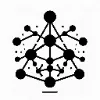

## Overview

This guide provides an overview of the different types of events generated by the system and details on how these events are categorized and stored. Understanding these event types and their destinations is crucial for integrating with the system, allowing for effective data management and retrieval.

## Events Overview

### Indices

**Description:** Index events are structured data points optimized for quick retrieval and efficient storage. These events are typically directed towards traditional database systems where they can be easily queried.

**Destination Databases:** Relational databases like PostgreSQL, MySQL, or specialized search engines like Elasticsearch.

### Graph

**Description:** Graph events represent relationships between entities, making them ideal for understanding connections and network structures. These events are best suited for graph databases.

**Destination Databases:** Graph databases such as Neo4j or Amazon Neptune, which allow for complex queries over relationships.

### Vectors

**Description:** Vector events contain high-dimensional data points used for similarity search and machine learning models. These events are directed towards databases optimized for handling vector space operations.

**Destination Databases:** Vector databases like PGVector or SurrealDB or Milvus, designed for efficient similarity search and retrieval in large datasets.

## Event Payload Descriptions

## General Event Structure

This section provides simplified descriptions of the event data structures generated by the system. These schemas outline the essential components of each event type, making it easier to understand the kind of data being processed and stored.

## Event Types

### Vector Events

**Description:** Vector events relate to high-dimensional data points used for machine learning models and similarity searches.

**Schema:**

- **Embeddings:** A list of floating-point numbers representing the vector in high-dimensional space.
- **Score:** The relationship confidence score of the vector.
- **Event ID:** A unique identifier for the event.

### Graph Events
**Description:** Graph events describe the relationships between entities, ideal for mapping connections and network structures. 

#### Graph
**Schema:**
- **Subject:** The entity from which a relationship originates.
- **Subject Type:** The classification or type of the subject entity.
- **Object:** The entity to which the relationship points.
- **Object Type:** The classification or type of the object entity.
- **Predicate:** The nature or description of the relationship between subject and object.
- **Predicate Type:** The classification of the relationship.
- **Sentence:** A textual representation or description of the relationship.
- **document_id:** The name of file to which the sentence belongs to.
- **document_source:** The source (file folder, google drive, azure blob storage etc.) where the document resides.
- **collection_id:** A unique id of the semantic data fabric.
- **image_id:** - A unique id for the image. 
- **Event ID:** A unique identifier for the event.

### Index Events

**Description:** Index events are structured records designed for efficient storage and retrieval, facilitating quick access to information.

**Schema:**

- Similar to traditional database records, Index events are characterized by their structured format, which includes various fields like ID, Name, Description, and Timestamp, among others. The specific fields depend on the application and the data being indexed.
