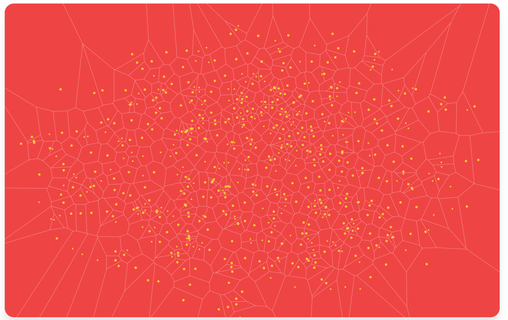

---
title: Retriever-Based Search vs. Traverser-Based Search
sidebar_position: 4
---

## Overview

This guide outlines the different data discovery methods available within R!AN, detailing the required configuration properties for each. These methods are integral for discovering data efficiently to generate meaningful insights.

### Retriever-Based Search

Retriever-based search is designed to find relevant documents and contexts using natural language queries. It utilizes contextually aware embeddings to perform similarity searches over the semantic data fabric. This approach focuses on retrieving documents that are semantically similar to the query, making it efficient for identifying relevant information quickly.

#### Key Features:

- **Contextually Aware Embeddings**: Uses embeddings that capture the semantic meaning of both the query and data by understanding the context in which data appears. This is more sophisticated than simple vector embeddings that only consider isolated data points.
- **Natural Language Queries**: Suitable for quick searches using natural language, making it user-friendly.
- **Similarity-Based Retrieval**: Retrieves documents based on their similarity to the query, providing relevant results efficiently.

#### Why Contextually Aware Embeddings are Better:

- **Enhanced Semantic Understanding**: Unlike simple vector embeddings that represent data points without considering their context, contextually aware embeddings understand the surrounding context, which leads to a more accurate and meaningful representation of data.
- **Reduced Noise**: By focusing on the context, these embeddings filter out irrelevant information, reducing noise and increasing the precision of the search results.
- **Improved Relevance**: The embeddings prioritize critical information, ensuring that the most relevant insights are surfaced during the search process.

### Semantic Data Fabric
The semantic data fabric overlays contextually aware embeddings to create a structured, interconnected representation of your data. This fabric not only enhances retrieval capabilities but also supports advanced graph traversal techniques for deeper insights.

*A voronoi point map to represent a 2D plot of contextually aware vectors as interconnected points in the semantic data fabric.*
 

#### Key Features:
 - **Integrated Context:** Combines multiple data points and their relationships, capturing the full context of the information.
 - **Structured Representation:** Forms a network of interconnected data points, enabling advanced search and analysis techniques.

### Traverser-Based Search

Traverser-based search leverages graph traversal techniques to explore the relationships between entities within the semantic data fabric. This method provides a deeper understanding of the interconnected data, uncovering hidden connections and patterns that might be missed by retrieval methods.

#### Key Features:

- **Graph Traversal**: Utilizes graph traversal techniques to explore and analyze relationships between entities, providing a comprehensive view of the data.
- **In-Depth Insights**: Offers richer insights and more detailed explanations by delving into the context surrounding the relationships.
- **Complex Query Handling**: Suitable for complex queries that require an understanding of data relationships, going beyond simple similarity searches.

#### Advantages of Traverser-Based Search:

- **Richer Insights**: By traversing the seamntic data fabric, this method uncovers deeper connections and patterns within the data, offering more detailed and insightful results.
- **Enhanced Data Connectivity**: It reveals hidden relationships between entities, leading to a more holistic understanding of the data.
- **Advanced Query Capabilities**: Traverser-based search can handle more complex queries, leveraging the interconnected nature of the data to provide answers that are both relevant and actionable.

## Summary

Both retriever-based and traverser-based searches have unique strengths that cater to different types of queries and data analysis needs. Retriever-based search is ideal for quick, similarity-based searches using natural language queries, enhanced by the use of contextually aware embeddings. Traverser-based search, on the other hand, excels in exploring complex relationships within the data through graph traversal, offering deeper insights and a more comprehensive understanding of the data landscape.

By leveraging these advanced search methods, R!AN empowers users to extract meaningful insights from their data, tailored to their specific requirements and contexts.

---

This document provides a detailed conceptual overview of the two main search methods used in R!AN, highlighting their unique features and advantages.