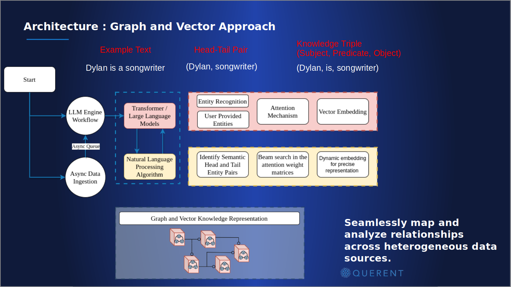

## Architecture

**R!AN** (Real-Time Information Aggregation Network) is a distributed semantic graph computing platform designed to capture, process, and derive knowledge from diverse data sources. The entire system is implemented in Rust, ensuring high performance, safety, and concurrency. The architecture consists of several interconnected components that work together to ingest and analyze data in the form of semantic data fabric.

## Components

Below are the key components of the **R!AN** architecture, each playing a crucial role in the system's functionality:

### LLM Engine Workflow and Async Data Ingestion

The system begins with the LLM Engine Workflow and Async Data Ingestion, both operating concurrently:

- **Async Data Ingestion:** Continuously and asynchronously polls data from a variety of sources, staging it in an asyncio queue without blocking system operations.
- **LLM Engine Workflow:** Utilizes transformer models to process data from the Async Queue, applying advanced natural language processing algorithms.

### Natural Language Processing and Entity Recognition

Once data is ingested, the system processes it using a combination of NLP techniques:

- **Transformer / Large Language Models:** Employed to handle complex language processing tasks.
- **Entity Recognition:** Identifies and extracts key entities from the data.
- **User-Provided Entities:** Allows for the inclusion of entities specified by users.
- **Attention Mechanism:** Helps to focus on the most relevant parts of the data for semantic triple extraction.
- **Vector Embedding:** Transforms extracted semantic triple into vector embeddings for further processing.

### Semantic Triple Extraction and Embedding

The processed data undergoes further analysis to generate meaningful insights:

- **Identify Semantic Head and Tail Entity Pairs:** Determines the relationships between different entities.
- **Beam Search in Attention Weight Matrices:** Refines the relationships using advanced search techniques.
- **Dynamic Embedding for Precise Representation:** Adjusts embeddings dynamically to ensure accurate representation of data relationships.

### Graph and Vector Knowledge Representation

The final step involves mapping the processed data into a graph and vector representation:

- **Graph and Vector Knowledge Representation:** Constructs a semantic knowledge graph with embedded vector representations, facilitating efficient querying and knowledge retrieval.

*Figure 1: Sequential Workflow of the R!AN System Architecture - This diagram illustrates the flow of data through the R!AN system, depicting how various components interact to process and analyze data using advanced graph neural network techniques.*

## Data Flow and Interactions

1. Data ingestion begins with the Async Data Ingestion component, continuously polling data from various external sources.
2. The ingested data is staged in an Async Queue, awaiting processing.
3. The LLM Engine Workflow processes the data using transformer models and NLP algorithms.
4. Entity Recognition identifies key entities within the processed data.
5. User-provided entities are integrated for enhanced context.
6. The Attention Mechanism identifies semantic relationships between head and tail entity pairs.
7. Beam Search refines these relationships using the attention weight matrices.
8. Dynamic embedding adjusts representations for accuracy.
9. The processed data is then mapped into a comprehensive graph and vector knowledge representation.
10. The knowledge graph facilitates efficient querying and retrieval of interconnected data insights.

