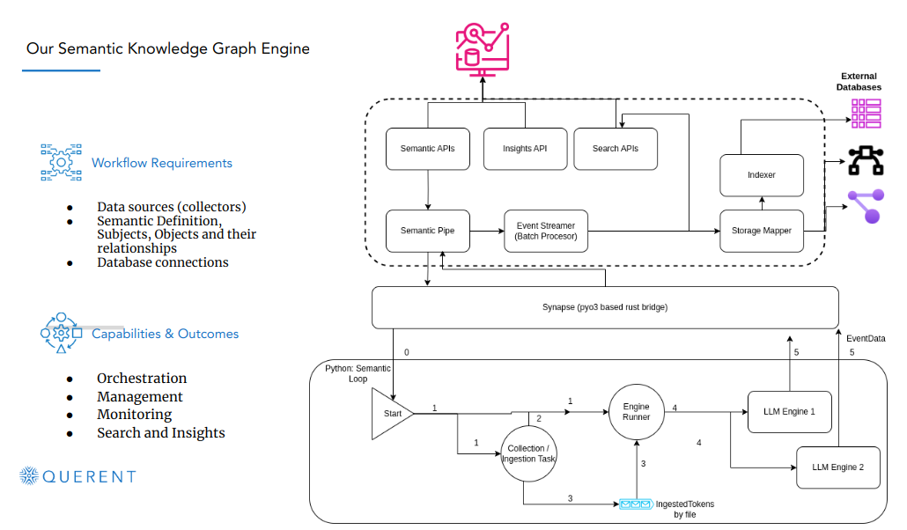

## Overview

Querent is a distributed semantic graph computing platform designed to capture, process, and derive knowledge from diverse data sources. It consists of several interconnected components that work together to ingest, analyze, and visualize data in the form of semantic graphs.

## Components

### 1. Ingestion Layer

The ingestion layer is responsible for collecting data from various sources and transforming it into a format suitable for semantic graph processing. It includes components such as:

- **Event Streamer:** Streams events from different sources in real-time or batch mode.
- **Storage Mapper:** Maps data from different storage systems to a common schema for processing.

### 2. Engine

The engine is the core processing component of Querent, where semantic graph computations take place. It includes modules for:

- **Graph Processing:** Analyzes and processes incoming data to construct and update the semantic graph.
- **Knowledge Inference:** Infers implicit relationships or properties within the graph to enrich knowledge.

### 3. Bridge

The bridge component acts as an interface between Querent and external systems or services. It facilitates data exchange and interoperability with:

- **External Data Sources:** Integrates with databases, APIs, or data lakes to fetch additional information.
- **Third-Party Tools:** Allows integration with analytics, visualization, or machine learning frameworks.

### 4. Workflow Management

Workflow management orchestrates the execution of tasks and workflows within Querent. It includes features for:

- **Task Scheduling:** Plans and schedules data processing tasks based on dependencies and resource availability.
- **Error Handling:** Manages retries, error logging, and recovery mechanisms for fault tolerance.

### 5. Indexing

The indexing component organizes and stores semantic graph data for efficient retrieval and querying. It includes:

- **Indexer:** Creates and maintains indexes of the semantic graph for fast access and search.
- **Graph Storage:** Stores graph data in distributed storage systems or databases for scalability and durability.

### 6. Graph Neural Network (GNN) Experiment Layer

The GNN experiment layer enables experimentation with graph neural networks for advanced analytics and machine learning tasks. It provides:

- **Model Training:** Trains GNN models using graph data and labeled examples for various tasks such as node classification or link prediction.
- **Evaluation:** Evaluates model performance and effectiveness on real-world graph datasets.

## Interactions

The components of Querent interact with each other to perform end-to-end data processing and analysis:

- Data is ingested from external sources via the ingestion layer and transformed into a semantic graph format.
- The engine processes the graph data, infers knowledge, and updates the graph accordingly.
- The bridge facilitates communication with external systems for data exchange and integration.
- Workflow management orchestrates the execution of tasks and workflows based on predefined logic and dependencies.
- Indexed graph data is stored and made available for fast retrieval and querying.
- The GNN experiment layer enables experimentation with graph neural networks for advanced analytics.

## Conclusion

Querent provides a scalable, flexible, and efficient platform for semantic graph computing, enabling organizations to derive actionable insights and knowledge from their data. By leveraging distributed processing, advanced analytics, and machine learning techniques, Querent empowers users to unlock the full potential of their data assets.
