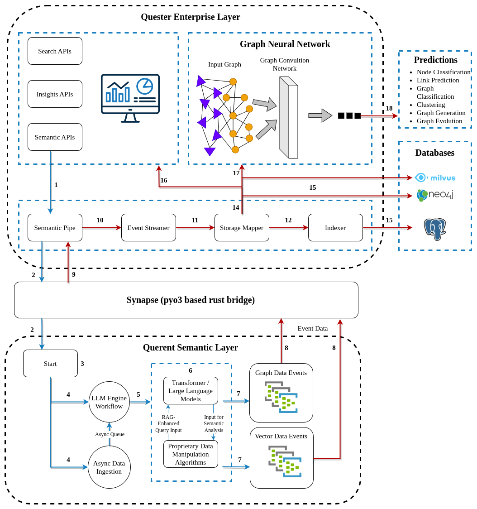

## Overview

Querent is a distributed semantic graph computing platform designed to capture, process, and derive knowledge from diverse data sources. It consists of several interconnected components that work together to ingest, analyze, and visualize data in the form of semantic graphs.

## Components
Before detailing the interactions within the system, it is crucial to understand the individual components and their roles. Below is a list of key components, for reference:

### Querent Enterprise Layer
Responsible for interfacing with external APIs and directing the flow of semantically processed data through the system, it consists of:

- **Search APIs, Insights APIs, Semantic APIs**: Interfaces for various data operations and services.
  
- **Semantic Pipe**: The Semantic Pipe serves as a vital conduit within the Querent system, enabling dynamic communication between the Enterprise Layer and the core processing engines. It orchestrates the data flow, ensuring that the Querent Semantic Layer can ingest data from sources as specified in the configuration. Additionally, it conveys parameters to the semantic engine, allowing it to initiate processing with the correct settings. It also acts as a bidirectional channel for transmitting processed data back through the system. In essence, the Semantic Pipe is crucial for the adaptability and responsiveness of the Querent system to changing data sources and processing requirements.

- **Event Streamer**: Streams data events within the system.
  
- **Storage Mapper**: Aligns data from the event streamer to a common schema for different storage systems (Neo4j and Milvus).
  
- **Indexer**: Creates and maintains indexes for efficiently querying data within the PostgreSQL database.

### Synapse (pyo3 based rust bridge)
Serves as an intermediary that bridges the Semantic Layer with the Enterprise Layer, utilizing pyo3 to allow Rust and Python interoperability. It provides support for:

- **External Data Sources:** Integrates with databases, APIs, or data lakes to fetch additional information.
  
- **Third-Party Tools:** Allows integration with analytics, visualization, or machine learning frameworks.

### Querent Semantic Layer
This is the core processing component of Querent, where semantic graph computations take place., involving:

- **Data Ingestion Workflow**: This component is responsible for the continuous and asynchronous polling of data from a multitude of sources, including Azure, Google Cloud Storage, Drive, Slack, and Jira. It is designed to efficiently fetch and stage data in a queue without blocking the system's operations.
  
- **Async Queue**: An asyncio queue that temporarily holds data from the Data Ingestion workflow before it is processed.
  
- **LLM Engine Workflow**: Utilizes advanced language models to concurrently process the data in the Async Queue. This workflow is designed to run in parallel with the Data Ingestion, allowing for simultaneous data ingestion and processing, which maximizes throughput and efficiency in the system's operations.
  
- **Graph Event**: Structured Graph JSON events of semantic triples, detailing the subject, object, predicate, their respective types, and contextual sentences for each semantic relationship identified.
  
- **Vector Event**: Structured Vector Events containing vector embeddings of the extracted contexts, which are essential for powering the semantic search engine's ability to locate and relate information.

### Graph Neural Network (GNN) Experiment Layer
This layer empowers users to actively engage with the data by training their own GNN models and conducting predictions. It is a testament to the system's flexibility and user-centric design, facilitating advanced data analysis through:

- **Graph Convolution Network (GCN)**: A powerful feature that enables users to apply convolutions on graph data, extracting essential features for a deep understanding of complex relationships.

- **User-Driven Model Training**: The system provides the capability for users to train GNN models on their specific graph data for tasks such as node classification and link prediction according to their unique analytical needs.

- **Custom Predictive Analytics**: After training, users can deploy their models to make predictions, enabling them to uncover insights like node properties, potential links, and overall graph dynamics, thus leveraging the full potential of GNN within their domain.

*Figure 1: Sequential Workflow of the Querent System Architecture - This diagram illustrates the flow of data through the Querent system, depicting how various components interact to process and analyze data using advanced graph neural network techniques.*

## Data Flow and Interactions

1. Workflow orchestration configurations are received from Semantic APIs within the Enterprise Layer.
2. The Semantic Pipe facilitates the transmission of configuration commands between the Enterprise Layer and the Semantic Layer.
3. The process begins with the initiation of the Querent Semantic Layer.
4. Asynchronous Data Ingestion collects data from various external sources.
5. The collected data is placed into an Async Queue, awaiting processing.
6. The LLM Engine Workflow processes the data using transformer/language models.
7. Graph Data Events and Vector Data Events are created based on the processed data.
8. These events are then transferred back through the Semantic Pipe to the Enterprise Layer.
9. Data flows through the Semantic Pipe, carrying processed events from the Semantic Layer.
10. The Event Streamer captures and forwards these events.
11. The Storage Mapper receives data events and aligns them for storage.
12 & 13. The Indexer creates and maintains indexes for the stored data within the PostgreSQL database.
14. Vector event data is stored in the Milvus database for vector information and graph event data is stored in the Neo4j database.
15. The Storage Mapper facilitates the usage of Search APIs and Insights API, providing it with the necessary data.
16. The Storage Mapper interacts with the Graph Neural Network, providing it with the necessary data.
17. The Graph Neural Network receives input graphs and performs advanced analytics. Predictions are generated from the Graph Neural Network, including node classification, link prediction, and graph evolution.

## Conclusion

Querent provides a scalable, flexible, and efficient platform for semantic graph computing, enabling organizations to derive actionable insights and knowledge from their data. By leveraging distributed processing, advanced analytics, and machine learning techniques, Querent empowers users to unlock the full potential of their data assets.

