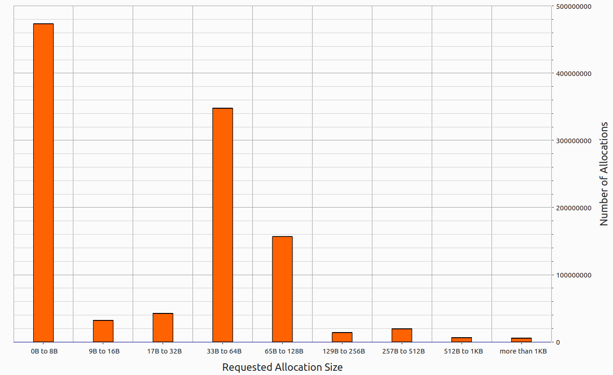
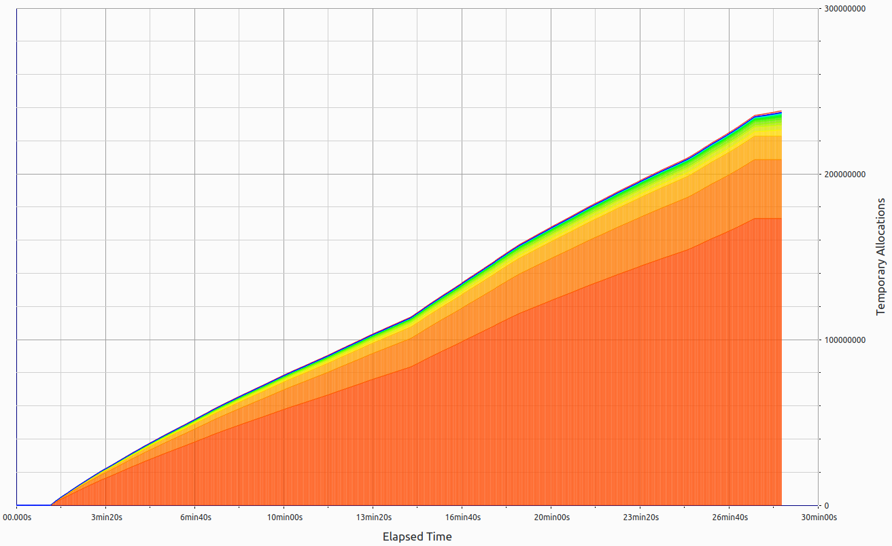
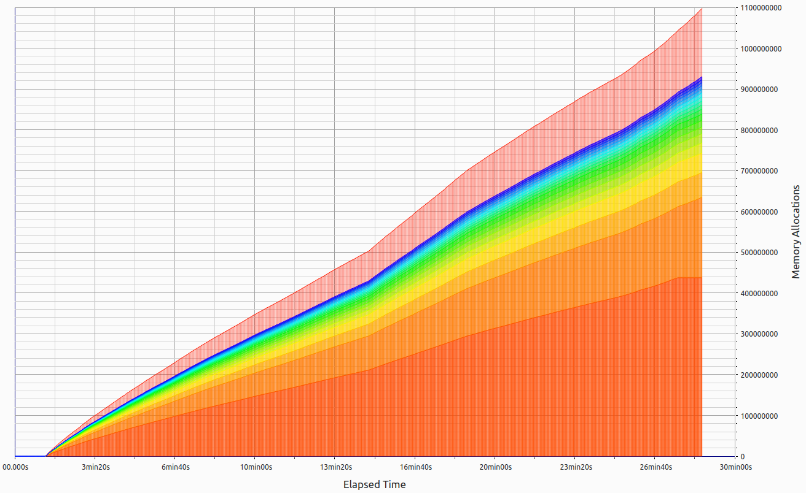
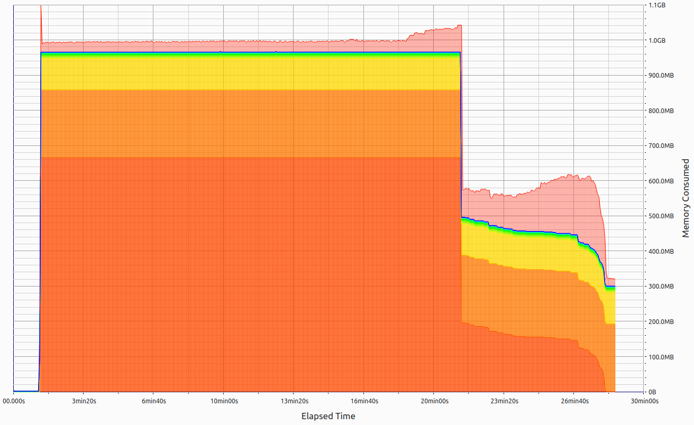

#### Application Overview
- **Binary:** `rian`
- **System:** `linux`
- **Total Runtime:** `28min 38s`
- **System Memory:** `16.1GB`
- **Files Processed:** `500 PDF files`
- **Data Volume:** `1 GB`
- **Events Produced:** `1500`

#### Memory Usage Analysis
- **Peak Heap Memory Consumption:** `1.1GB` after `1min 17s`
- **Peak RSS (Including Heaptrack Overhead):** `1.6GB`
- **Total Memory Leaked:** `314.0MB (42.5kB suppressed)`

#### Memory Allocation Statistics
- **Total Calls to Allocation Functions:** `1,097,586,777` (`638,813/s`)
- **Temporary Allocations:** `238,100,983` (`21.69%`, `138,578/s`)

#### Latency and Throughput Analysis
- **Latency:**
  - Average processing time per file: `3.43s`
  - Peak latency: `5.12s`
- **Throughput:**
  - Average throughput: `17.5 files/min`
  - Peak throughput: `22 files/min`

#### Graphical Analysis of Memory Consumption

- **Memory Consumption Graph:**
  - Demonstrates robust handling of dynamic data sets.
  - Several spikes in memory usage effectively managed within reasonable bounds.
  - Indicates the system's capability to handle significant loads with resilience, typical of processing extensive and diverse data sets like PDF files.

- **Allocation and Temporary Allocation Trends:**
  - The allocation graph illustrates a progressive increase in memory allocations consistent with the workload, reflecting the system’s scalable design in processing high volumes of data.
  - Temporary allocations increased significantly, showcasing the system's effective use of temporary data structures to ensure efficient processing.

#### Visual Representations

 

 

 

#### Summary
This performance analysis underscores the system’s high capability and adaptability in managing large-scale data processing tasks. The memory performance, particularly in the context of such a substantial data processing challenge, highlights the robust and effective design of the application. The handling of dynamic data sets and efficient memory allocation strategies show the advanced technological framework underpinning this system. Our commitment to continuous innovation ensures the application remains at the forefront of data processing solutions, delivering unmatched performance and reliability.
