Python pool enables the execution of Python tasks in a separate thread, allowing the main thread to continue processing other tasks without being blocked. This is particularly useful for handling long-running Python tasks, such as executing machine learning models or processing large datasets, without affecting the overall performance of the system.

## Python Pool

The Python Pool is a component of the Querent Semantic Layer that is responsible for executing Python tasks in a separate thread. It is designed to handle the execution of Python tasks in a separate thread, allowing the main thread to continue processing other tasks without being blocked. This is particularly useful for handling long-running Python tasks, such as executing machine learning models or processing large datasets, without affecting the overall performance of the system.

*Figure 2: Python Pool - This diagram illustrates the Python Pool component of the Querent Semantic Layer, which is responsible for executing Python tasks in a separate thread, allowing the main thread to continue processing other tasks without being blocked.*
