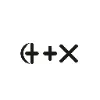

## Overview

**R!AN** supports a wide array of data sources and file types, enabling seamless ingestion and analysis of data from various platforms. This guide outlines the available collectors, their required configurations, and the supported file types.

## Supported Data Sources

R!AN provides collectors for the following platforms and services:

           

- **Google Drive (Freemium)**
- **Local Storage (Freemium)**
- **Azure Blob Storage**
- **Google Cloud Storage (GCS)**
- **Amazon S3**
- **Jira**
- **OneDrive**
- **Email (IMAP)**
- **Dropbox**
- **GitHub**
- **Slack**
- **News APIs**
- **Notion**
- **WebSocket and API Ingestion**

### Collectors and Configuration

Below are the required configurations for each supported data source. Ensure that you provide all necessary fields to successfully set up the collectors.

---

### **Azure Blob Storage Collector**

- **Type**: `AzureCollectorConfig`
- **Required Fields**:
  - `chunk_size`: Size of data chunks to process.
  - `connection_string`: Azure storage account connection string.
  - `account_url`: URL of the Azure storage account.
  - `credentials`: Authentication credentials.
  - `container`: Name of the Azure Blob Storage container.
  - `id`: Unique identifier for the collector.

---

### **Google Cloud Storage (GCS) Collector**

- **Type**: `GCSCollectorConfig`
- **Required Fields**:
  - `credentials`: Service account key for GCS access.
  - `bucket`: Name of the GCS bucket.
  - `id`: Unique identifier for the collector.

---

### **Amazon S3 Collector**

- **Type**: `S3CollectorConfig`
- **Required Fields**:
  - `access_key`: AWS access key ID.
  - `secret_key`: AWS secret access key.
  - `region`: AWS region of the S3 bucket.
  - `bucket`: Name of the S3 bucket.
  - `id`: Unique identifier for the collector.

---

### **Jira Collector**

- **Type**: `JiraCollectorConfig`
- **Required Fields**:
  - `jira_server`: URL of the Jira server.
  - `jira_username`: Username for Jira access.
  - `jira_project`: Key of the Jira project.
  - `jira_query`: JQL query to select issues.
  - `id`: Unique identifier for the collector.

---

### **Google Drive Collector**

- **Type**: `GoogleDriveCollectorConfig`
- **Required Fields**:
  - `drive_client_id`: Client ID for Google Drive API.
  - `drive_client_secret`: Client secret for Google Drive API.
  - `drive_token`: Access token for Google Drive API.
  - `drive_refresh_token`: Refresh token for Google Drive API.
  - `drive_scopes`: Scopes for Google Drive API access.
  - `id`: Unique identifier for the collector.

---

### **OneDrive Collector**

- **Type**: `OneDriveConfig`
- **Required Fields**:
  - `client_id`: Client ID of the app.
  - `client_secret`: Client secret of the app.
  - `refresh_token`: Refresh token for OneDrive API.
  - `redirect_uri`: Redirect URI.
  - `folder_path`: Folder path to access.
  - `id`: Unique identifier for the collector.

---

### **Email Collector (IMAP)**

- **Type**: `EmailCollectorConfig`
- **Required Fields**:
  - `imap_server`: IMAP server address.
  - `imap_port`: Port number for the IMAP server.
  - `imap_username`: Username for IMAP access.
  - `imap_password`: Password for IMAP access.
  - `imap_folder`: IMAP folder to collect emails from.
  - `id`: Unique identifier for the collector.

---

### **Dropbox Collector**

- **Type**: `DropBoxCollectorConfig`
- **Required Fields**:
  - `dropbox_app_key`: App key for Dropbox API.
  - `dropbox_app_secret`: App secret for Dropbox API.
  - `dropbox_refresh_token`: Refresh token for Dropbox API.
  - `folder_path`: Path of the Dropbox folder.
  - `id`: Unique identifier for the collector.

---

### **GitHub Collector**

- **Type**: `GithubCollectorConfig`
- **Required Fields**:
  - `github_username`: Username for GitHub access.
  - `github_access_token`: Access token for GitHub API.
  - `repository`: Name of the GitHub repository.
  - `id`: Unique identifier for the collector.

---

### **Slack Collector**

- **Type**: `SlackCollectorConfig`
- **Required Fields**:
  - `access_token`: Access token for Slack API.
  - `channel_name`: Name of the Slack channel.
  - `id`: Unique identifier for the collector.

---

### **News Collector**

- **Type**: `NewsCollectorConfig`
- **Required Fields**:
  - `api_key`: API key for the news service.
  - `query`: Query string for news retrieval.
  - `from_date`: Start date for the news query.
  - `to_date`: End date for the news query.
  - `id`: Unique identifier for the collector.

---

## Ingested Data via WebSocket and API (Pro)

In addition to the data collectors, the Querent Node supports ingesting tokens directly through WebSocket connections and a dedicated API endpoint. This functionality allows for real-time data ingestion from various sources, facilitating immediate processing and analysis.

### Ingesting Tokens via API

- **Endpoint:** `/api/v1/semantics/{pipeline_id}/ingest`
- **Method:** `PUT`
- **Description:** This endpoint allows for sending tokens to a semantic pipeline by providing `IngestedTokens`. It requires specifying the `pipeline_id` to which the tokens should be ingested.
- **Required Parameters:**
  - `pipeline_id` (path parameter) - The pipeline ID running the semantic loop to ingest tokens.
- **Request Body Schema:** `IngestedTokens`
  - **Type:** `object`
  - **Required Fields:**
    - `file` - The identifier or name of the file being ingested.
  - **Optional Fields:**
    - `data` (array of strings) - An optional array of tokens that can be directly provided for ingestion.
    - `is_token_stream` (boolean) - An optional flag indicating whether the provided data is a continuous stream of tokens.

### WebSocket Ingestion

For WebSocket-based ingestion, clients can connect to a WebSocket endpoint provided by the **R!AN** Node. Once connected, clients can stream `IngestedTokens` directly into the specified data fabric pipeline. The WebSocket endpoint and specifics regarding the protocol and data format will depend on the implementation details of the Node and the environment in which it is deployed.

**Note:** The WebSocket ingestion mechanism requires a persistent connection and is suitable for scenarios where real-time data streaming is necessary.

---

## Supported File Types

R!AN supports a wide variety of file types, ensuring you can process and analyze data from numerous sources. The supported file types include:

- **Text Documents**:
  - `.txt`, `.doc`, `.docx`, `.odt`, `.pdf`
- **Spreadsheets**:
  - `.csv`, `.xlsx`, `.ods`
- **Presentations**:
  - `.pptx`, `.odp`
- **Web Content**:
  - `.html`, `.xml`
- **Code Files**:
  - Source code files (e.g., `.py`, `.java`, `.js`, `.cpp`)
- **JSON Files**:
  - `.json`

---

## Summary

R!AN's flexible ingestion methods and support for numerous data sources and file types make it a powerful tool for both batch and real-time data processing. Whether you need immediate processing, handle large data volumes, or prefer specific integration patterns, R!AN can adapt to your application's requirements.

## Need Help?

If you have questions or need assistance configuring collectors or ingesting data, please reach out:

- **Email**: [contact@querent.xyz](mailto:contact@querent.xyz)
- **GitHub**: [Open an Issue](https://github.com/Querent-ai/support/issues)
- **Discord**: [Join Our Community](https://discord.gg/3fVAVmZXyh)
