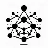

## Overview

This guide provides an overview of the different types of events generated by **R!AN** and details how these events are categorized and stored. Understanding these event types and their destinations is crucial for integrating with the system, allowing for effective data management and retrieval.

## Event Categories

R!AN generates three primary types of events:

1. **Index Events**
2. **Graph Events**
3. **Vector Events**

Each event type serves a specific purpose and is stored in a database optimized for its data structure.

---

### **1. Index Events**

**Description:** Index events are structured data points optimized for quick retrieval and efficient storage. They are designed to facilitate rapid querying and data retrieval operations.

**Use Cases:**

- Full-text search
- Filtering and sorting records
- Quick access to structured information

**Destination Databases:** Relational databases like **PostgreSQL**, **MySQL**, or specialized search engines like **Elasticsearch**.

---

### **2. Graph Events**

**Description:** Graph events represent relationships between concepts/entities, making them ideal for understanding connections and network structures within your data.

**Use Cases:**

- Social network analysis
- Recommendation systems
- Knowledge graphs

**Destination Databases:** Graph databases such as **Neo4j** , which allow for complex queries over relationships.

---

### **3. Vector Events**

**Description:** Vector events contain high-dimensional contextually-aware vectors used for similarity search and machine learning applications. They are essential for tasks involving embeddings and vector space computations.

**Use Cases:**

- Semantic search space
- Recommendation engines
- Graph Neural Networks

**Destination Databases:** Vector databases like **PGVector**, or **Embedded Postgres**, designed for efficient similarity search and retrieval in large datasets.

---

## Summary

R!AN's event-based architecture allows for efficient data processing and storage by categorizing data into Index, Graph, and Vector events. Each event type is optimized for specific use cases and stored in databases suited to their data structures, enabling high-performance data retrieval and analysis.

By understanding these event types and their schemas, you can effectively integrate R!AN into your data processing workflows and leverage its capabilities for advanced data management.

## Need Help?

If you have questions or need assistance:

- **Email**: [contact@querent.xyz](mailto:contact@querent.xyz)
- **GitHub**: [Open an Issue](https://github.com/Querent-ai/support/issues)
- **Discord**: [Join Our Community](https://discord.gg/3fVAVmZXyh)

